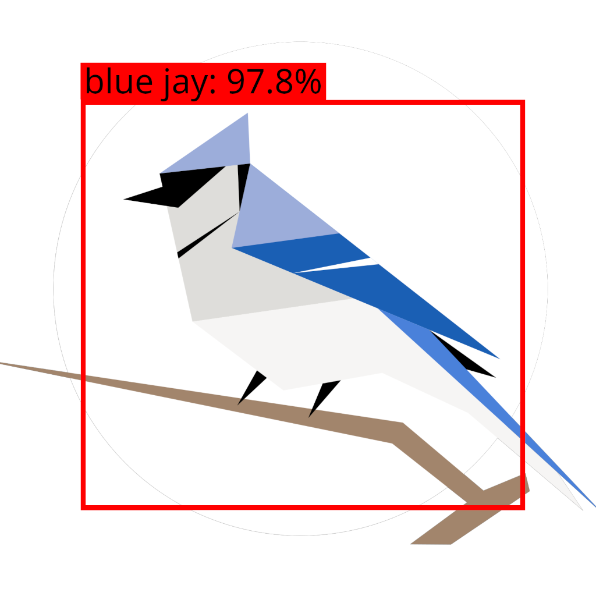

<div align="center">
  <h1>BirdBox</h1>
  
  
  <p><strong>Deep Learning Bird Call Detection & Evaluation System</strong></p>
  
  [](https://www.python.org/downloads/release/python-3120/)
  
</div>

BirdBox is a comprehensive system for detecting and evaluating bird calls in audio recordings using deep learning. It leverages YOLO (You Only Look Once) object detection on spectrogram images to identify and localize bird vocalizations in time and frequency.

## Key Features

**Arbitrary-Length Audio Processing** - Handle audio from seconds to hours  
**Song Reconstruction** - Automatically merge temporally adjacent detections into continuous bird songs  
**Batch Processing** - Process entire directories of audio files  
**PCEN Normalization** - Per-Channel Energy Normalization for robust spectral features  
**Comprehensive Evaluation** - F-beta analysis, confusion matrices, optimal threshold finding  
**Multiple Output Formats** - JSON, CSV (compatible with annotation formats)  
**Model Agnostic** - Works with `.pt`, `.onnx`, `.engine` model formats

## YOLO-Models

Trained YOLO-Models for this task can be found on the **[TUC-Cloud](https://tuc.cloud/index.php/s/ET4KE4LdSaysSSL)**.
Alternatively, you can train your own model on a custom dataset by using the code available in the **[BirdBox-Train](https://github.com/birdnet-team/BirdBox-Train)** repository.

To specify the model using the CLI, just pass the relative path of the model as the `--model` command-line argument. 
If you use the code as a package, you can specify the `model` function parameter to match the relative path of the model file.

**Important:** The species mapping in the `conf.yaml` file the model is trained with and the [`ID_TO_EBIRD_CODES` dictionary in `src/config.py`](src/config.py#L32-L60) have to match.

## Quick Start

### Installation

```bash
# Clone the repository
git clone https://github.com/birdnet-team/BirdBox.git
cd BirdBox

# Create virtual environment
python3 -m venv .venv
source .venv/bin/activate  # On Windows: .venv\Scripts\activate

# Install dependencies
pip install -r requirements.txt
```

### Basic Usage, i. e. run detection on audio

```bash
# Detect birds in a single audio file
python src/inference/detect_birds.py \
    --audio path/to/recording.wav \
    --model models/best.pt

# Or process entire directory (batch processing)
python src/inference/detect_birds.py \
    --audio path/to/audio/folder \
    --model models/best.pt \
```

## Documentation

This repository includes comprehensive documentation for all features:

### [INFERENCE.md](INFERENCE.md)
Complete guide to bird call detection:
- Command-line and Python API usage
- How the detection pipeline works (PCEN → spectrograms → YOLO)
- Song reconstruction algorithm
- Batch processing
- Parameter tuning (confidence, IoU, song gap thresholds)
- Output formats and examples
- Troubleshooting guide


### [EVALUATION.md](EVALUATION.md)
Complete guide to evaluating detection performance:
- **F-Beta Score Analysis** - Find optimal confidence thresholds
- **Detection Filtering** - Apply confidence thresholds to results
- **Confusion Matrix Analysis** - Understand species-level performance
- Best practices and complete workflow examples
- Understanding precision, recall, and F-beta scores

## Typical Workflow

### Complete Detection & Evaluation Pipeline

```bash
# Step 1: Run comprehensive detection with low confidence threshold
python src/inference/detect_birds.py \
    --audio data/test_audio/ \
    --model models/best.pt \
    --conf 0.001 \
    --output-path results/all_detections \
    --output-format json

# Step 2: Analyze F-beta scores to find optimal threshold
python src/evaluation/f_beta_score_analysis.py \
    --detections results/all_detections.json \
    --labels data/test_labels.csv \
    --beta 2.0 \
    --output-path results/f_beta_analysis

# Step 3: Filter detections to optimal threshold (e.g., 0.35)
python src/evaluation/filter_detections.py \
    --input results/all_detections.json \
    --conf 0.35 \
    --output-path results/filtered_detections \
    --format all

# Step 4: Generate confusion matrix
python src/evaluation/confusion_matrix_analysis.py \
    --detections results/filtered_detections.csv \
    --labels data/test_labels.csv \
    --output-path results/confusion_matrix

# Step 5: Examine results in results/ directory
```

See [EVALUATION.md](EVALUATION.md) for detailed workflow examples.

## Package Usage

### Detection Library

```python
from inference.detect_birds import BirdCallDetector

# Initialize detector
detector = BirdCallDetector(
    model_path="models/best.pt",
    conf_threshold=0.001,
    song_gap_threshold=0.1
)

# Detect birds
detections = detector.detect(
    "path/to/audio.wav",
    output_path="results/detections"
)

# Print summary
detector.print_summary(detections)

# Access detection data
for det in detections:
    print(f"{det['species']}: {det['time_start']:.1f}s - {det['time_end']:.1f}s "
          f"(confidence: {det['confidence']:.3f})")
```

### Evaluation Library

```python
from evaluation.f_beta_score_analysis import FBetaScoreAnalyzer

# Create analyzer
analyzer = FBetaScoreAnalyzer(
    iou_threshold=0.5,
    beta=2.0,
    use_optimal_matching=True
)

# Analyze performance
results_df = analyzer.analyze_confidence_thresholds(
    detections_path="results/all_detections.json",
    labels_path="data/ground_truth.csv",
    confidence_thresholds=[0.1, 0.2, 0.3, 0.4, 0.5]
)

# Find optimal thresholds
optimal_df = analyzer.find_optimal_thresholds(results_df)
print(optimal_df)
```

## Performance Optimization

### For Detection
- Use GPU acceleration (automatically detected)
- Use TensorRT models (`.engine`) for NVIDIA GPUs
- Lower confidence threshold for comprehensive detection, filter later
- Adjust `song_gap_threshold` based on species vocalization patterns
- Adjust `ìou-threshold` to fit the specific use-case

### For Evaluation
- Tune the β-Parameter for the Fβ-Analysis to fit the specific use-case
- β < 1 leads to more weight on precision
- β > 1 leads to more weight on recall

## Troubleshooting

### Common Issues

**"No detections found"**
- Lower confidence threshold (`--conf 0.001`)
- Check if audio file is valid WAV format
- Verify model is trained on similar species

**"Out of memory errors"**
- Process shorter audio files
- Reduce PCEN segment length in config
- Use smaller YOLO model (e.g., yolo11n instead of yolo11l)

**"No matching files in evaluation"**
- Check filename formats (tools auto-normalize extensions)
- Verify ground truth CSV has correct column names
- Ensure audio filenames match between detections and labels

See [INFERENCE.md](INFERENCE.md#troubleshooting) and [EVALUATION.md](EVALUATION.md#troubleshooting) for more details.

## Citation

Feel free to use BirdBox for your acoustic analyses and research. If you do, please cite as:

```bibtex
@article{kahl2021birdnet,
  title={BirdNET: A deep learning solution for avian diversity monitoring},
  author={Kahl, Stefan and Wood, Connor M and Eibl, Maximilian and Klinck, Holger},
  journal={Ecological Informatics},
  volume={61},
  pages={101236},
  year={2021},
  publisher={Elsevier}
}
```

## Funding

Our work in the K. Lisa Yang Center for Conservation Bioacoustics is made possible by the generosity of K. Lisa Yang to advance innovative conservation technologies to inspire and inform the conservation of wildlife and habitats.

The development of BirdNET is supported by the German Federal Ministry of Research, Technology and Space (FKZ 01|S22072), the German Federal Ministry for the Environment, Climate Action, Nature Conservation and Nuclear Safety (FKZ 67KI31040E), the German Federal Ministry of Economic Affairs and Energy (FKZ 16KN095550), the Deutsche Bundesstiftung Umwelt (project 39263/01) and the European Social Fund.

## Partners

BirdNET is a joint effort of partners from academia and industry.
Without these partnerships, this project would not have been possible.
Thank you!


