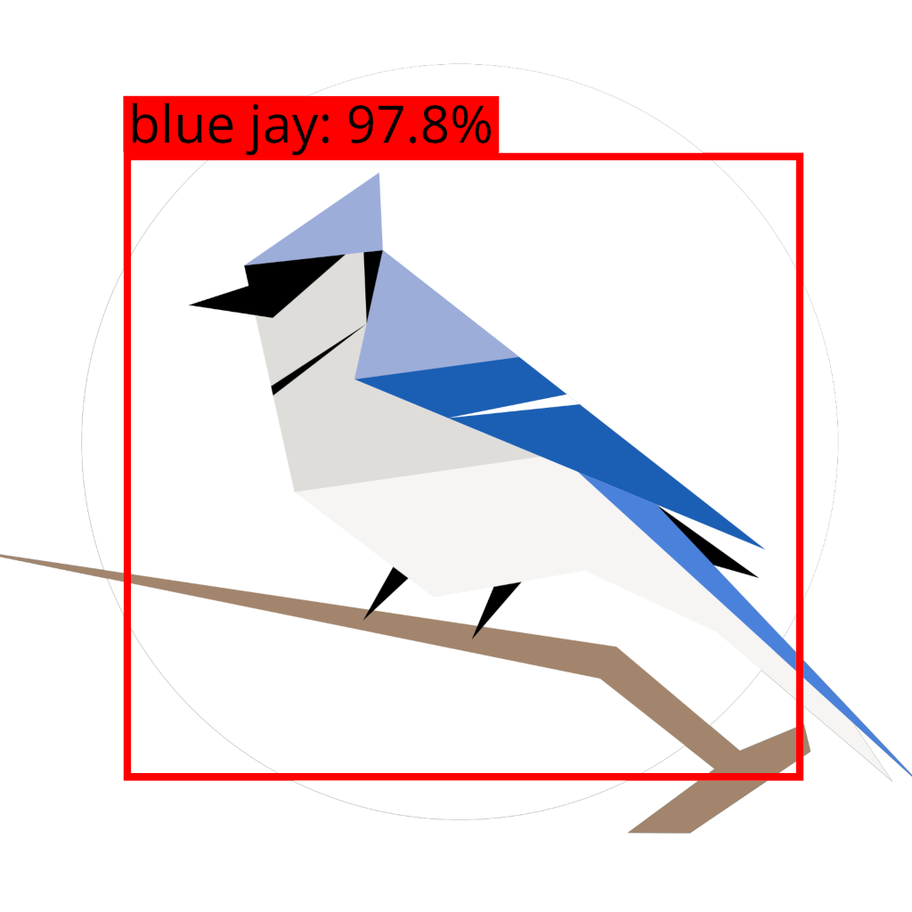
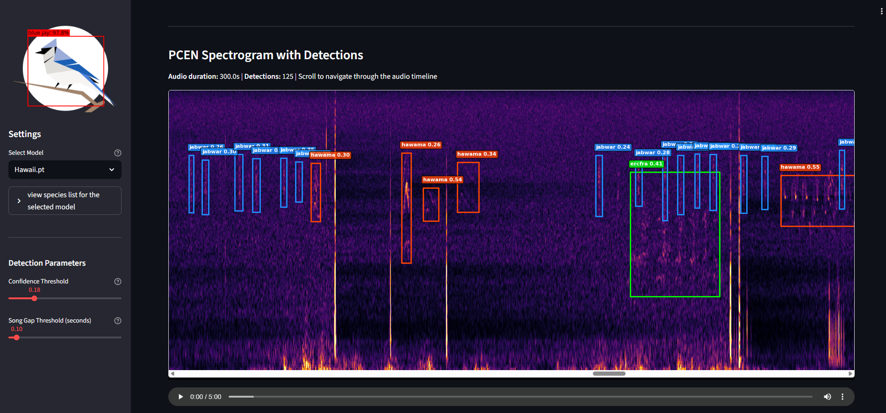

<div align="center">
  <h1>BirdBox</h1>
  
  
  
  <p><strong>Deep Learning Bird Call Detection & Evaluation System</strong></p>
  
  <a href="https://github.com/birdnet-team/BirdBox/blob/main/LICENSE" target="_blank" rel="noopener noreferrer"></a>
  <a href="https://www.python.org/downloads/release/python-31213/" target="_blank" rel="noopener noreferrer"></a>
  

</div>

BirdBox is a comprehensive system for detecting and evaluating bird calls in audio recordings using deep learning. It leverages YOLO (You Only Look Once) object detection on spectrogram images to identify and localize bird vocalizations in time and frequency.

⚠️ **Note**: This project is still under active development. Performance may vary.

## Documentation

Everything you need, including installation instructions, an interactive demo, model metrics, and the CLI Reference, can be found in the [BirdBox Documentation](https://birdnet-team.github.io/BirdBox/).

## Quick Links

- [Installation](https://birdnet-team.github.io/BirdBox/getting-started/installation/) - set up the environment
- [Data Flow](https://birdnet-team.github.io/BirdBox/data/overview/) - pipeline description
- [Models and Metrics](https://birdnet-team.github.io/BirdBox/models-and-metrics/overview/) - list of models with corresponding metrics
- [CLI Reference](https://birdnet-team.github.io/BirdBox/cli/workflows/) - command line interface
- [API Reference](https://birdnet-team.github.io/BirdBox/api/config/) - application programming interface

## Interactive Demo

Try out the [Interactive Demo](https://birdnet.cornell.edu/birdbox/) or browse the [Demo Documentation](https://birdnet-team.github.io/BirdBox/getting-started/demo/).
If everything is working as expected, the web interface will look like this:



## Citation

Feel free to use BirdBox for your acoustic analyses and research. If you do, please cite as:

```bibtex
@software{Schlosser_BirdBox,
    author = {Schlosser, Elias and Kahl, Stefan and Eibl, Maximilian},
    license = {MIT},
    title = {{BirdBox}},
    url = {https://github.com/birdnet-team/BirdBox}
}
```

## License

The source code is licensed under the MIT License.
See the [License](https://github.com/birdnet-team/BirdBox?tab=MIT-1-ov-file) for details.

## Funding

Our work in the K. Lisa Yang Center for Conservation Bioacoustics is made possible by the generosity of K. Lisa Yang to advance innovative conservation technologies to inspire and inform the conservation of wildlife and habitats.

The development of BirdNET is supported by the German Federal Ministry of Research, Technology and Space (FKZ 01|S22072), the German Federal Ministry for the Environment, Climate Action, Nature Conservation and Nuclear Safety (FKZ 67KI31040E), the German Federal Ministry of Economic Affairs and Energy (FKZ 16KN095550), the Deutsche Bundesstiftung Umwelt (project 39263/01) and the European Social Fund.

## Partners

BirdNET is a joint effort of partners from academia and industry.
Without these partnerships, this project would not have been possible.
Thank you!


