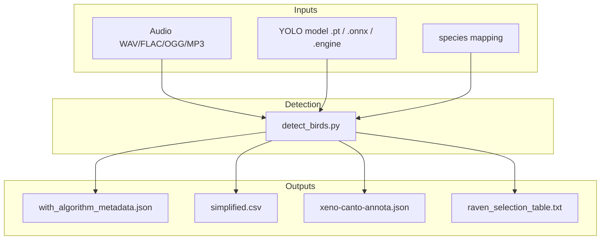
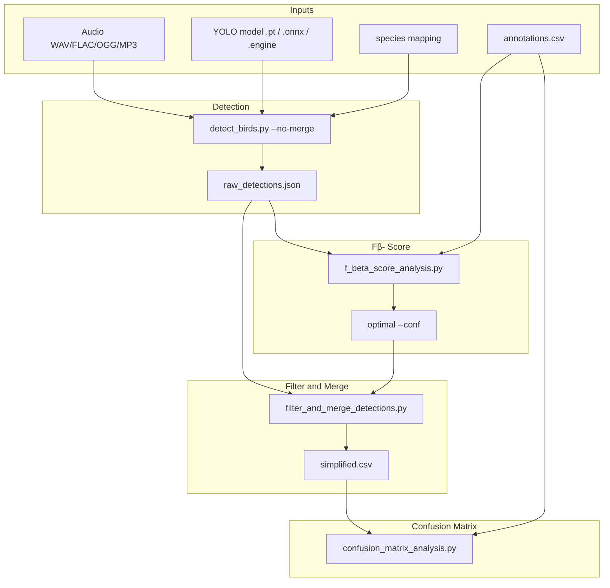

# Data and Formats

BirdBox moves data through a small set of well-defined file types: audio and models go in, detections and evaluation artifacts come out. This section is the schema contract for pipeline scripts, external tools, and anyone wiring BirdBox into a larger workflow.

---

## File Flow for Detection Only

For field use or exporting annotations. No ground-truth CSV and no evaluation scripts. You run inference once at a chosen `--conf`. Song merging happens inside `detect_birds.py` unless you pass `--no-merge`.

Use `--output-format all` to write every format in one run, or pick a single format. Details are on [Detection outputs](../cli/detect-birds.md#output-formats) in this section.

---

## File Flow for Detection and Evaluation

For benchmarking on a labeled test set. Run detection once at very low confidence with `--no-merge`, tune threshold utilizing `annotations.csv`, then filter + merge and score errors. This matches `run_pipeline.sh` at the repository root.

Step-by-step CLI usage for each script is under [CLI Reference](../cli/workflows.md) in the site navigation.
