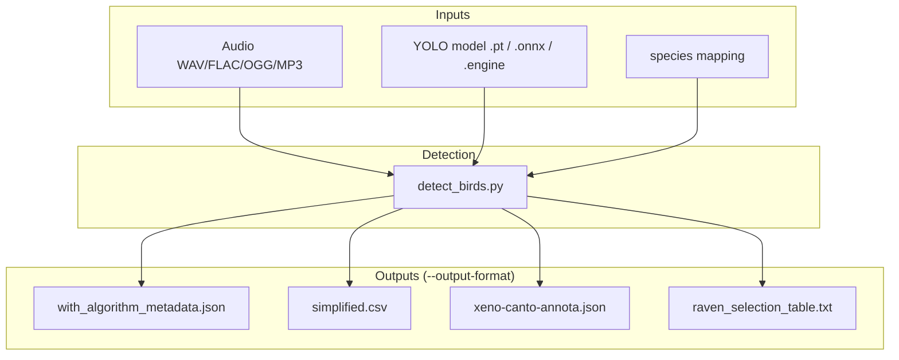
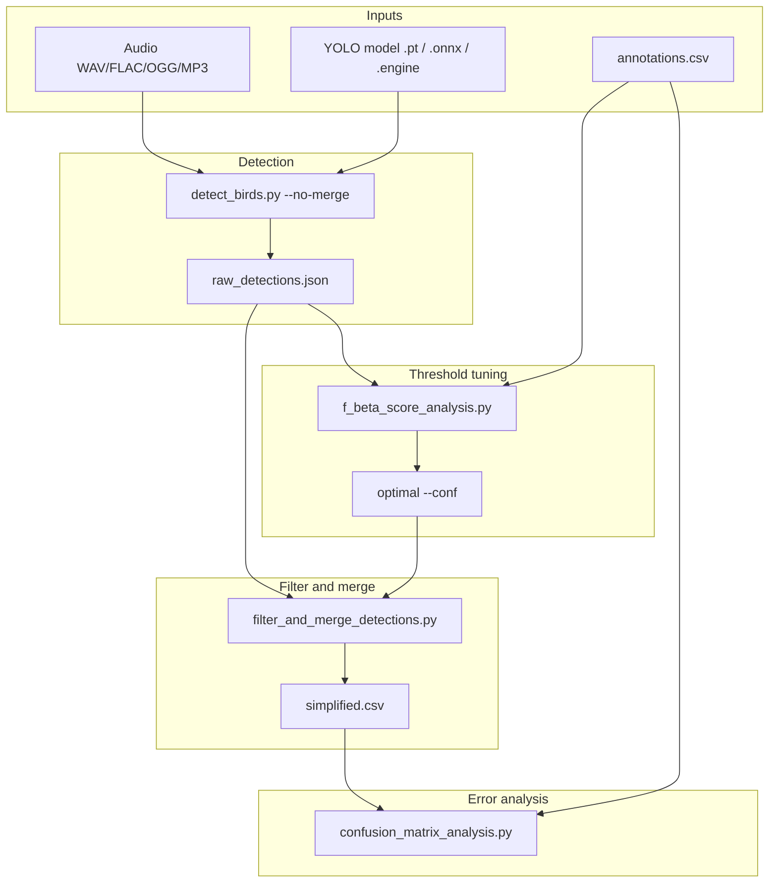

# Data and Formats

BirdBox moves data through a small set of well-defined file types: audio and models go in, detections and evaluation artifacts come out. This section is the schema contract for pipeline scripts, external tools, and anyone wiring BirdBox into a larger workflow.

## What goes where

| Stage | You provide | BirdBox produces |
| :--- | :--- | :--- |
| Inference | Audio files, a YOLO model, a species mapping | Detection files (`--output-format` on [`detect_birds.py`](../cli/detect-birds.md)) |
| Threshold tuning | Raw detection JSON + ground-truth CSV | F-beta tables and plots ([`f_beta_score_analysis.py`](../cli/f-beta-score-analysis.md)) |
| Post-processing | Raw detection JSON + chosen confidence | Filtered/merged detections ([`filter_and_merge_detections.py`](../cli/filter-and-merge-detections.md)) |
| Error analysis | Merged detection CSV + ground-truth CSV | Confusion matrices ([`confusion_matrix_analysis.py`](../cli/confusion-matrix-analysis.md)) |

## Typical file flows

### Detection only

For field use or exporting annotations—no ground-truth CSV and no evaluation scripts. You run inference once at a chosen `--conf`; song merging happens inside `detect_birds.py` unless you pass `--no-merge`.

Use `--output-format all` to write every format in one run, or pick a single format. Details are on **Detection outputs** in this section.

### Detection and evaluation (ground truth)

For benchmarking on a labeled test set: run detection once at very low confidence with `--no-merge`, tune threshold against `annotations.csv`, then filter/merge and score errors. This matches `run_pipeline.sh` / `run_pipeline.bat` at the repository root.

Step-by-step CLI usage for each script is under **CLI Reference** in the site navigation.
