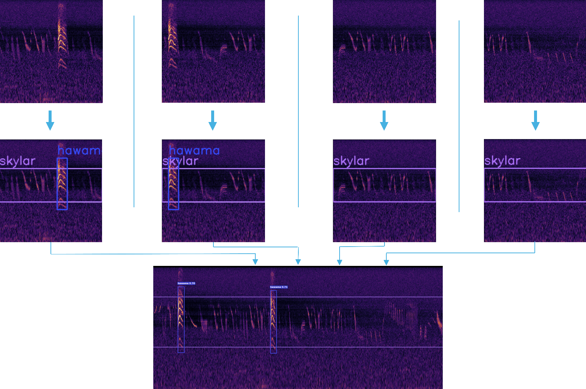

This section describes the algorithmic ideas and the concepts utilized within BirdBox during inference.

For user facing parameters see [CLI Reference](../cli/workflows.md) or [API Reference](../api/api-type.md).
To compare different models take a look at [Models and Metrics](../models-and-metrics/overview.md).
If you are interested in the file flow see [File Flows](../data/fileflows.md).

## Inference Algorithm Concept

The key idea of the BirdBox inference is to use YOLO[[1]](#ref-redmon) from Ultralytics[[2]](#ref-jocher) with a sliding window approach.
Since we can't run yolo on continuous audio data, we have to divide that data into smaller chunks.
Each chunk contains one minute of audio and is then processed as follows:

1. Compute a mel spectrogram with STFT[[3]](#ref-allen) and PCEN[[4]](#ref-lostanlen)
2. Create 3 second clips with 50% overlap
3. Run the trained YOLO object detection model on each clip
4. Convert boxes from YOLO-notation to time and frequency
5. Merge detections across windows
6. Provide detections in multiple formats for further analysis

To examine the generation of the spectrograms in detail see [Spectrogram Generation](spectrogram.md).
The various output data formats provided by BirdBox can be examined in [Detection Output Formats](../data/outputs.md).

## Detect and Merge Policy

The following visualization shows the detection of bounding boxes within each clip as well as the subsequent merging of the detections.

The overlap leads to the benefit, that each vocalization which is present in 1.5 seconds or below, is seen at full at least once.
Only bird vocalizations above that threshold could be chopped into multiple parts.
Additionally, the overlap leads to the advantage, that missing detections can be inferred from neighboring ones.
If clip one as well as clip three contain the same bounding box, then it is likely that clip two also contains it.

Multiple merging parameters can be set for this process.
Many of them are handled automatically, but it is recommended to dial in the song gap threshold according to the utilized dataset. For details see [Song Gap Threshold](../cli/detect-birds.md#-song-gap-song-gap-threshold).

## References

**[1]** Redmon, J., et. al. (2016). "You Only Look Once: Unified, Real-Time Object Detection.“ Proceedings of the IEEE Conference on Computer Vision and Pattern Recognition (CVPR).

**[2]** Jocher, G., et. al. (2026). "Ultralytics YOLO26: Unified Real-Time End-to-End Vision Models" arXiv preprint arXiv:2606.03748.

**[3]** Allen, J. B., et. al. (2005). "A unified approach to short-time Fourier analysis and synthesis." Proceedings of the IEEE, 65(11), 1558–1564.

**[4]** Lostanlen, V. (2021). "Self-calibrating acoustic sensor networks with per-channel energy normalization." Proceedings of Euronoise 2021. Sociedade Portuguesa de Acústica.

