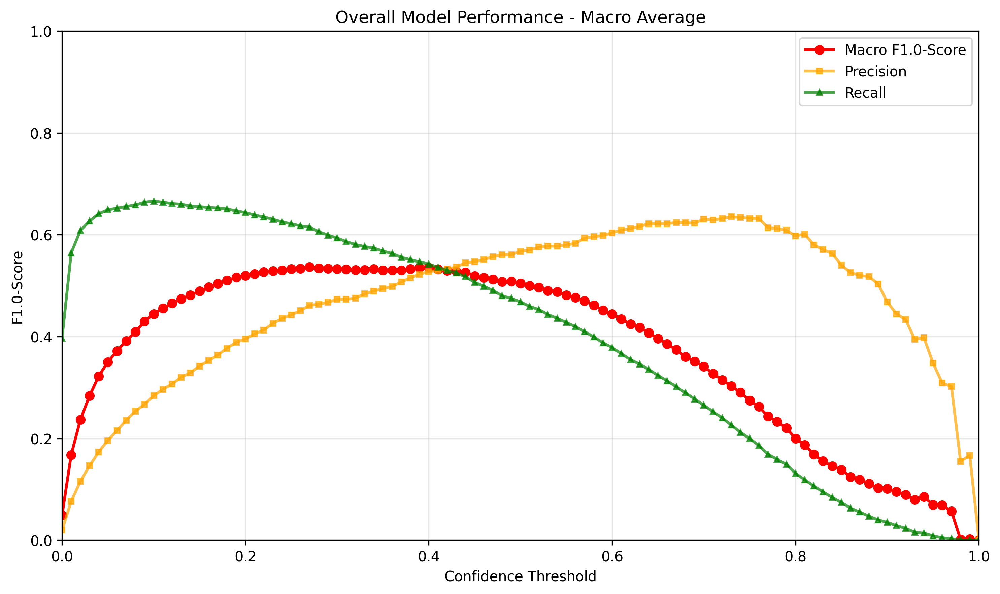
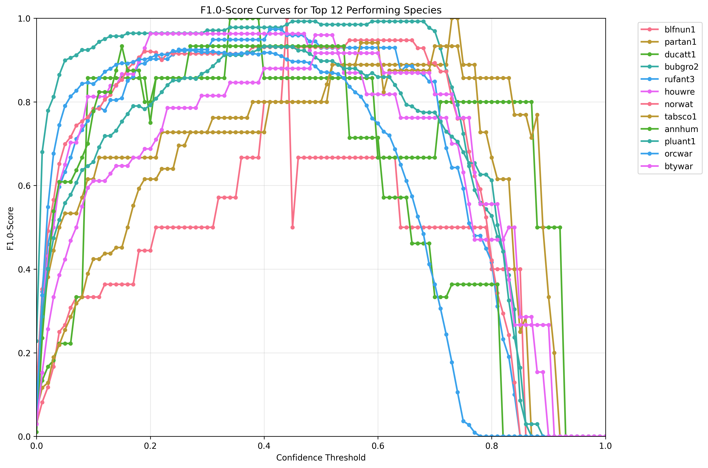
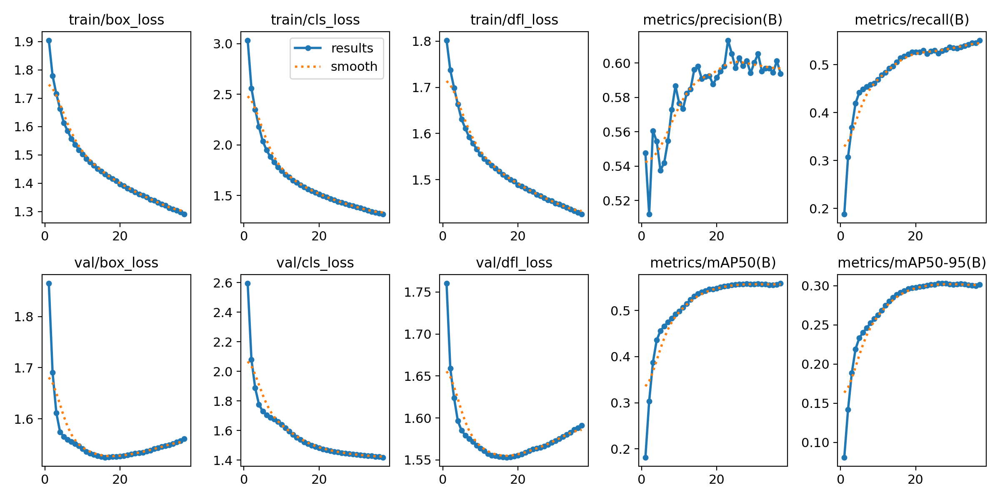

# All in One Model

The All in One Model combines all five zenodo datasets mentioned in the [introduction](overview.md#available-models).
It therefore utilized almost 407 hours of soundscape recordings with 155,584 bounding box labels spanning across 282 different bird species.

---

## Precision, Recall and F1-Score

The graphs below show the performance of the model on the **testset** under different confidence thresholds.
The measured metrics are precision, recall and the F1-score.
If we want to optimize the F1-score for the model, one should thus pick a confidence-threshold-value around 0.27.

!!! info "Rising Recall at Low Confidence"
    The rising recall from confidence values 0 to ~0.1 is unusual but by design. At very low confidence thresholds, the merging algorithm produces imprecise merged boxes that can accidentally overlap more ground truth labels. See [How it works](../getting-started/how-it-works.md) for details.

---

## Top Performing Species

The data below shows the F1-score for the best 12 performing species within the test dataset.
This implies that a detection of those species in new unseen data is highly accurate if the confidence threshold is set to around 0.4.

---

## Training Results

The following figure illustrates various data that has been recorded during training.
The metrics have been computed after each epoch with the evaluation split of the dataset.

!!! info "Model Checkpoint"
    The weights that produced the highest `metrics/mAP50-95` on the validation split were selected for the final model.

---

## Species Distribution Across Splits

The following table shows the amount of annotations in total and for each species as described in [Dataset Splits](overview.md#dataset-splits).

| Species | Train | Val | Test | Total | 70/15/15 Quality {: data-sort-method="mixed-split" } |
| :--- | :---: | :---: | :---: | :---: | :--- |
| ***Total*** | ***366,106*** | ***78,680*** | ***82,978*** | ***527,764*** | ***69.4/14.9/15.7*** {: data-sort-method="none" } |
| ???? | 13,996 | 3,009 | 3,318 | 20,323 | 68.9/14.8/16.3 |
| akepa1 | 962 | 199 | 209 | 1,370 | 70.2/14.5/15.3 |
| aldfly | 1,556 | 328 | 333 | 2,217 | 70.2/14.8/15.0 |
| amabaw1 | 391 | 85 | 89 | 565 | 69.2/15.0/15.8 |
| amapyo1 | 303 | 68 | 63 | 434 | 69.8/15.7/14.5 |
| amecro | 6,506 | 1,387 | 1,706 | 9,599 | 67.8/14.4/17.8 |
| amegfi | 6,237 | 1,339 | 1,476 | 9,052 | 68.9/14.8/16.3 |
| amepip | 2,757 | 581 | 637 | 3,975 | 69.4/14.6/16.0 |
| amerob | 14,114 | 3,036 | 3,103 | 20,253 | 69.7/15.0/15.3 |
| amewoo | 186 | 41 | 41 | 268 | 69.4/15.3/15.3 |
| annhum | 85 | 20 | 30 | 135 | 63.0/14.8/22.2 |
| apapan | 7,265 | 1,544 | 1,482 | 10,291 | 70.6/15.0/14.4 |
| baffal1 | 868 | 195 | 190 | 1,253 | 69.3/15.6/15.2 |
| balori | 1,734 | 365 | 402 | 2,501 | 69.3/14.6/16.1 |
| barpet | 598 | 117 | 130 | 845 | 70.8/13.8/15.4 |
| bartin2 | 238 | 57 | 50 | 345 | 69.0/16.5/14.5 |
| belkin1 | 177 | 37 | 40 | 254 | 69.7/14.6/15.7 |
| bkcchi | 9,215 | 1,983 | 2,176 | 13,374 | 68.9/14.8/16.3 |
| bkhgro | 3,843 | 825 | 838 | 5,506 | 69.8/15.0/15.2 |
| blbthr1 | 983 | 209 | 224 | 1,416 | 69.4/14.8/15.8 |
| blcbec1 | 113 | 24 | 28 | 165 | 68.5/14.5/17.0 |
| blfant1 | 4,185 | 902 | 906 | 5,993 | 69.8/15.1/15.1 |
| blfcot1 | 98 | 22 | 22 | 142 | 69.0/15.5/15.5 |
| blfjac1 | 212 | 76 | 54 | 342 | 62.0/22.2/15.8 |
| blfnun1 | 187 | 41 | 41 | 269 | 69.5/15.2/15.2 |
| bltant2 | 177 | 24 | 29 | 230 | 77.0/10.4/12.6 |
| blttro1 | 634 | 133 | 141 | 908 | 69.8/14.6/15.5 |
| blujay | 6,814 | 1,464 | 1,650 | 9,928 | 68.6/14.7/16.6 |
| bnhcow | 245 | 52 | 51 | 348 | 70.4/14.9/14.7 |
| brncre | 456 | 101 | 111 | 668 | 68.3/15.1/16.6 |
| bsbeye1 | 198 | 49 | 43 | 290 | 68.3/16.9/14.8 |
| btywar | 199 | 53 | 38 | 290 | 68.6/18.3/13.1 |
| bubgro2 | 1,066 | 230 | 221 | 1,517 | 70.3/15.2/14.6 |
| bubwre1 | 3,045 | 654 | 669 | 4,368 | 69.7/15.0/15.3 |
| bucmot4 | 1,498 | 319 | 328 | 2,145 | 69.8/14.9/15.3 |
| buffal1 | 148 | 27 | 41 | 216 | 68.5/12.5/19.0 |
| buhvir | 220 | 44 | 39 | 303 | 72.6/14.5/12.9 |
| butsal1 | 579 | 122 | 136 | 837 | 69.2/14.6/16.2 |
| butwoo1 | 1,744 | 381 | 379 | 2,504 | 69.6/15.2/15.1 |
| buwwar | 195 | 43 | 41 | 279 | 69.9/15.4/14.7 |
| calqua | 89 | 19 | 20 | 128 | 69.5/14.8/15.6 |
| cangoo | 7,404 | 1,560 | 2,117 | 11,081 | 66.8/14.1/19.1 |
| casvir | 213 | 52 | 46 | 311 | 68.5/16.7/14.8 |
| cedwax | 958 | 204 | 238 | 1,400 | 68.4/14.6/17.0 |
| chswar | 501 | 109 | 111 | 721 | 69.5/15.1/15.4 |
| chwfog1 | 139 | 32 | 39 | 210 | 66.2/15.2/18.6 |
| cintin1 | 1,458 | 304 | 306 | 2,068 | 70.5/14.7/14.8 |
| citwoo1 | 649 | 133 | 145 | 927 | 70.0/14.3/15.6 |
| clanut | 709 | 151 | 149 | 1,009 | 70.3/15.0/14.8 |
| coffal1 | 111 | 16 | 26 | 153 | 72.5/10.5/17.0 |
| coltro1 | 479 | 95 | 110 | 684 | 70.0/13.9/16.1 |
| comgra | 2,423 | 510 | 532 | 3,465 | 69.9/14.7/15.4 |
| comrav | 475 | 101 | 92 | 668 | 71.1/15.1/13.8 |
| comyel | 3,990 | 864 | 908 | 5,762 | 69.2/15.0/15.8 |
| cowpar1 | 231 | 64 | 61 | 356 | 64.9/18.0/17.1 |
| crfgle1 | 149 | 29 | 29 | 207 | 72.0/14.0/14.0 |
| daejun | 801 | 157 | 166 | 1,124 | 71.3/14.0/14.8 |
| dowwoo | 1,046 | 222 | 328 | 1,596 | 65.5/13.9/20.6 |
| ducatt1 | 92 | 32 | 16 | 140 | 65.7/22.9/11.4 |
| ducfly | 174 | 44 | 33 | 251 | 69.3/17.5/13.1 |
| ducgre1 | 1,310 | 308 | 364 | 1,982 | 66.1/15.5/18.4 |
| dusfly | 2,775 | 583 | 602 | 3,960 | 70.1/14.7/15.2 |
| dutant2 | 728 | 182 | 161 | 1,071 | 68.0/17.0/15.0 |
| easkin | 842 | 183 | 178 | 1,203 | 70.0/15.2/14.8 |
| easpho | 2,081 | 463 | 472 | 3,016 | 69.0/15.4/15.6 |
| eastow | 1,249 | 272 | 275 | 1,796 | 69.5/15.1/15.3 |
| eawpew | 6,400 | 1,370 | 1,434 | 9,204 | 69.5/14.9/15.6 |
| elepai | 219 | 49 | 40 | 308 | 71.1/15.9/13.0 |
| elewoo1 | 119 | 29 | 32 | 180 | 66.1/16.1/17.8 |
| ercfra | 5,269 | 1,162 | 1,282 | 7,713 | 68.3/15.1/16.6 |
| eursta | 184 | 40 | 39 | 263 | 70.0/15.2/14.8 |
| fasant1 | 563 | 149 | 124 | 836 | 67.3/17.8/14.8 |
| fepowl | 121 | 25 | 29 | 175 | 69.1/14.3/16.6 |
| foxspa | 2,345 | 483 | 489 | 3,317 | 70.7/14.6/14.7 |
| gcrfin | 1,889 | 411 | 372 | 2,672 | 70.7/15.4/13.9 |
| gilbar1 | 63 | 31 | 14 | 108 | 58.3/28.7/13.0 |
| gnttow | 461 | 98 | 103 | 662 | 69.6/14.8/15.6 |
| gockin | 7,533 | 1,584 | 1,600 | 10,717 | 70.3/14.8/14.9 |
| gocspa1 | 272 | 61 | 44 | 377 | 72.1/16.2/11.7 |
| goeant1 | 778 | 162 | 151 | 1,091 | 71.3/14.8/13.8 |
| grasal3 | 346 | 72 | 72 | 490 | 70.6/14.7/14.7 |
| grcfly | 2,520 | 540 | 574 | 3,634 | 69.3/14.9/15.8 |
| greant1 | 370 | 81 | 86 | 537 | 68.9/15.1/16.0 |
| greibi1 | 97 | 39 | 12 | 148 | 65.5/26.4/8.1 |
| grfdov1 | 2,478 | 535 | 579 | 3,592 | 69.0/14.9/16.1 |
| gryant1 | 179 | 36 | 43 | 258 | 69.4/14.0/16.7 |
| gryant2 | 1,426 | 327 | 331 | 2,084 | 68.4/15.7/15.9 |
| grycat | 10,133 | 2,182 | 2,351 | 14,666 | 69.1/14.9/16.0 |
| haiwoo | 373 | 77 | 83 | 533 | 70.0/14.4/15.6 |
| hauthr1 | 12,374 | 2,843 | 2,845 | 18,062 | 68.5/15.7/15.8 |
| hawama | 10,616 | 2,157 | 2,251 | 15,024 | 70.7/14.4/15.0 |
| hawcre | 897 | 230 | 194 | 1,321 | 67.9/17.4/14.7 |
| hawhaw | 254 | 51 | 54 | 359 | 70.8/14.2/15.0 |
| hawpet1 | 790 | 188 | 193 | 1,171 | 67.5/16.1/16.5 |
| herthr | 6,186 | 1,392 | 1,356 | 8,934 | 69.2/15.6/15.2 |
| herwar | 1,248 | 271 | 270 | 1,789 | 69.8/15.1/15.1 |
| horscr1 | 259 | 52 | 54 | 365 | 71.0/14.2/14.8 |
| houfin | 5,044 | 1,110 | 997 | 7,151 | 70.5/15.5/13.9 |
| houwre | 165 | 34 | 35 | 234 | 70.5/14.5/15.0 |
| hutvir | 91 | 25 | 28 | 144 | 63.2/17.4/19.4 |
| iiwi | 8,695 | 1,847 | 1,800 | 12,342 | 70.5/15.0/14.6 |
| jabwar | 422 | 96 | 61 | 579 | 72.9/16.6/10.5 |
| littin1 | 2,077 | 436 | 437 | 2,950 | 70.4/14.8/14.8 |
| lobwoo1 | 518 | 117 | 109 | 744 | 69.6/15.7/14.7 |
| lowant1 | 461 | 92 | 92 | 645 | 71.5/14.3/14.3 |
| macwar | 1,511 | 322 | 334 | 2,167 | 69.7/14.9/15.4 |
| mallar3 | 314 | 66 | 72 | 452 | 69.5/14.6/15.9 |
| meapar | 1,430 | 316 | 287 | 2,033 | 70.3/15.5/14.1 |
| melthr | 1,209 | 226 | 283 | 1,718 | 70.4/13.2/16.5 |
| mouchi | 7,066 | 1,598 | 1,537 | 10,201 | 69.3/15.7/15.1 |
| moudov | 272 | 56 | 61 | 389 | 69.9/14.4/15.7 |
| mouqua | 581 | 111 | 119 | 811 | 71.6/13.7/14.7 |
| naswar | 147 | 35 | 29 | 211 | 69.7/16.6/13.7 |
| norcar | 5,092 | 1,509 | 2,915 | 9,516 | 53.5/15.9/30.6 |
| norfli | 2,017 | 430 | 442 | 2,889 | 69.8/14.9/15.3 |
| norwat | 391 | 82 | 82 | 555 | 70.5/14.8/14.8 |
| omao | 2,812 | 580 | 643 | 4,035 | 69.7/14.4/15.9 |
| orcwar | 3,246 | 695 | 692 | 4,633 | 70.1/15.0/14.9 |
| ovenbi1 | 6,435 | 1,378 | 1,643 | 9,456 | 68.1/14.6/17.4 |
| partan1 | 453 | 105 | 102 | 660 | 68.6/15.9/15.5 |
| pasfly | 858 | 190 | 188 | 1,236 | 69.4/15.4/15.2 |
| pilwoo | 412 | 89 | 94 | 595 | 69.2/15.0/15.8 |
| pirfly1 | 3,726 | 870 | 794 | 5,390 | 69.1/16.1/14.7 |
| pluant1 | 1,082 | 226 | 234 | 1,542 | 70.2/14.7/15.2 |
| plupig2 | 1,394 | 318 | 301 | 2,013 | 69.2/15.8/15.0 |
| plwant1 | 464 | 104 | 100 | 668 | 69.5/15.6/15.0 |
| purfin | 468 | 90 | 97 | 655 | 71.5/13.7/14.8 |
| putfru1 | 498 | 107 | 102 | 707 | 70.4/15.1/14.4 |
| pygant1 | 298 | 63 | 66 | 427 | 69.8/14.8/15.5 |
| reblei | 6,093 | 1,247 | 1,333 | 8,673 | 70.3/14.4/15.4 |
| rebmac2 | 110 | 28 | 20 | 158 | 69.6/17.7/12.7 |
| rebnut | 2,276 | 476 | 477 | 3,229 | 70.5/14.7/14.8 |
| rebwoo | 1,658 | 349 | 396 | 2,403 | 69.0/14.5/16.5 |
| reevir1 | 10,476 | 2,233 | 2,327 | 15,036 | 69.7/14.9/15.5 |
| rewbla | 8,456 | 1,813 | 1,939 | 12,208 | 69.3/14.9/15.9 |
| rinant2 | 122 | 27 | 26 | 175 | 69.7/15.4/14.9 |
| rinwoo1 | 83 | 17 | 19 | 119 | 69.7/14.3/16.0 |
| rocwre | 1,498 | 319 | 326 | 2,143 | 69.9/14.9/15.2 |
| ruboro1 | 1,050 | 219 | 216 | 1,485 | 70.7/14.7/14.5 |
| rudpig | 539 | 135 | 112 | 786 | 68.6/17.2/14.2 |
| rufant3 | 842 | 178 | 176 | 1,196 | 70.4/14.9/14.7 |
| ruqdov | 181 | 32 | 43 | 256 | 70.7/12.5/16.8 |
| scatan | 1,809 | 393 | 396 | 2,598 | 69.6/15.1/15.2 |
| scrpih1 | 2,215 | 469 | 458 | 3,142 | 70.5/14.9/14.6 |
| skylar | 7,457 | 1,584 | 1,603 | 10,644 | 70.1/14.9/15.1 |
| snogoo | 271 | 58 | 63 | 392 | 69.1/14.8/16.1 |
| sobcac1 | 361 | 92 | 80 | 533 | 67.7/17.3/15.0 |
| sonspa | 3,956 | 851 | 936 | 5,743 | 68.9/14.8/16.3 |
| spigua1 | 167 | 41 | 36 | 244 | 68.4/16.8/14.8 |
| spotow | 328 | 69 | 69 | 466 | 70.4/14.8/14.8 |
| spwant2 | 1,262 | 281 | 277 | 1,820 | 69.3/15.4/15.2 |
| stejay | 1,259 | 258 | 252 | 1,769 | 71.2/14.6/14.2 |
| strcuc1 | 278 | 36 | 0 | 314 | 88.5/11.5/0.0 |
| strwoo2 | 537 | 125 | 116 | 778 | 69.0/16.1/14.9 |
| swaspa | 1,366 | 262 | 255 | 1,883 | 72.5/13.9/13.5 |
| tabsco1 | 165 | 36 | 37 | 238 | 69.3/15.1/15.5 |
| thlwre1 | 3,958 | 850 | 872 | 5,680 | 69.7/15.0/15.4 |
| towwar | 93 | 25 | 19 | 137 | 67.9/18.2/13.9 |
| tuftit | 5,366 | 1,146 | 1,203 | 7,715 | 69.6/14.9/15.6 |
| undtin1 | 1,225 | 263 | 261 | 1,749 | 70.0/15.0/14.9 |
| veery | 3,940 | 845 | 844 | 5,629 | 70.0/15.0/15.0 |
| viotro3 | 465 | 90 | 88 | 643 | 72.3/14.0/13.7 |
| warwhe1 | 3,889 | 849 | 866 | 5,604 | 69.4/15.1/15.5 |
| wespuf1 | 72 | 15 | 16 | 103 | 69.9/14.6/15.5 |
| westan | 2,506 | 545 | 524 | 3,575 | 70.1/15.2/14.7 |
| whbnut | 1,308 | 280 | 294 | 1,882 | 69.5/14.9/15.6 |
| whbtot1 | 118 | 23 | 29 | 170 | 69.4/13.5/17.1 |
| whcspa | 7,135 | 1,678 | 1,479 | 10,292 | 69.3/16.3/14.4 |
| whnrob1 | 512 | 117 | 117 | 746 | 68.6/15.7/15.7 |
| whrsir1 | 120 | 27 | 26 | 173 | 69.4/15.6/15.0 |
| whtspa | 138 | 33 | 28 | 199 | 69.3/16.6/14.1 |
| whttou1 | 1,727 | 374 | 358 | 2,459 | 70.2/15.2/14.6 |
| whwbec1 | 1,258 | 274 | 243 | 1,775 | 70.9/15.4/13.7 |
| wibpip1 | 293 | 68 | 67 | 428 | 68.5/15.9/15.7 |
| wiltur | 77 | 19 | 18 | 114 | 67.5/16.7/15.8 |
| wlswar | 203 | 37 | 46 | 286 | 71.0/12.9/16.1 |
| wooduc | 216 | 49 | 67 | 332 | 65.1/14.8/20.2 |
| woothr | 7,470 | 1,583 | 1,656 | 10,709 | 69.8/14.8/15.5 |
| yebsap | 631 | 139 | 184 | 954 | 66.1/14.6/19.3 |
| yefcan | 242 | 57 | 52 | 351 | 68.9/16.2/14.8 |
| yelwar | 580 | 126 | 125 | 831 | 69.8/15.2/15.0 |
| yemfly1 | 219 | 48 | 51 | 318 | 68.9/15.1/16.0 |
| yercac1 | 96 | 15 | 9 | 120 | 80.0/12.5/7.5 |
| yerwar | 2,228 | 453 | 438 | 3,119 | 71.4/14.5/14.0 |
| yetvir | 493 | 99 | 104 | 696 | 70.8/14.2/14.9 |
| acowoo | 57 | 0 | 0 | 57 | Train-only |
| amered | 4 | 0 | 0 | 4 | Train-only |
| astgna1 | 42 | 0 | 0 | 42 | Train-only |
| barant1 | 4 | 0 | 0 | 4 | Train-only |
| batman1 | 11 | 0 | 0 | 11 | Train-only |
| batpig1 | 28 | 0 | 0 | 28 | Train-only |
| bcnher | 2 | 0 | 0 | 2 | Train-only |
| bewwre | 4 | 0 | 0 | 4 | Train-only |
| bkbwar | 45 | 0 | 0 | 45 | Train-only |
| blacar1 | 31 | 0 | 0 | 31 | Train-only |
| blctro1 | 34 | 0 | 0 | 34 | Train-only |
| blgdov1 | 5 | 0 | 0 | 5 | Train-only |
| blhpar1 | 86 | 0 | 0 | 86 | Train-only |
| blkfra | 6 | 0 | 0 | 6 | Train-only |
| bobfly1 | 58 | 0 | 0 | 58 | Train-only |
| boboli | 19 | 0 | 0 | 19 | Train-only |
| brdowl | 78 | 0 | 0 | 78 | Train-only |
| brebla | 2 | 0 | 0 | 2 | Train-only |
| brratt1 | 64 | 0 | 0 | 64 | Train-only |
| btfgle1 | 2 | 0 | 0 | 2 | Train-only |
| btnwar | 10 | 0 | 0 | 10 | Train-only |
| casfin | 83 | 0 | 0 | 83 | Train-only |
| chbchi | 73 | 0 | 0 | 73 | Train-only |
| chukar | 86 | 0 | 0 | 86 | Train-only |
| cinmou1 | 89 | 0 | 0 | 89 | Train-only |
| compot1 | 14 | 0 | 0 | 14 | Train-only |
| comwax | 15 | 0 | 0 | 15 | Train-only |
| coohaw | 71 | 0 | 0 | 71 | Train-only |
| duhpar | 18 | 0 | 0 | 18 | Train-only |
| easblu | 20 | 0 | 0 | 20 | Train-only |
| eulfly1 | 3 | 0 | 0 | 3 | Train-only |
| evegro | 32 | 0 | 0 | 32 | Train-only |
| forela1 | 47 | 0 | 0 | 47 | Train-only |
| garkin1 | 3 | 0 | 0 | 3 | Train-only |
| gnbtro1 | 24 | 0 | 0 | 24 | Train-only |
| gogwoo1 | 10 | 0 | 0 | 10 | Train-only |
| gramou1 | 80 | 0 | 0 | 80 | Train-only |
| grbher3 | 20 | 0 | 0 | 20 | Train-only |
| grcfly1 | 8 | 0 | 0 | 8 | Train-only |
| gretin1 | 46 | 0 | 0 | 46 | Train-only |
| gycfly1 | 6 | 0 | 0 | 6 | Train-only |
| gycwor1 | 48 | 0 | 0 | 48 | Train-only |
| hamfly | 4 | 0 | 0 | 4 | Train-only |
| hawgoo | 3 | 0 | 0 | 3 | Train-only |
| hoowar | 43 | 0 | 0 | 43 | Train-only |
| kalphe | 17 | 0 | 0 | 17 | Train-only |
| killde | 96 | 0 | 0 | 96 | Train-only |
| lazbun | 22 | 0 | 0 | 22 | Train-only |
| letbar1 | 73 | 0 | 0 | 73 | Train-only |
| linspa | 29 | 0 | 0 | 29 | Train-only |
| litwoo2 | 11 | 0 | 0 | 11 | Train-only |
| moublu | 65 | 0 | 0 | 65 | Train-only |
| muswre2 | 23 | 0 | 0 | 23 | Train-only |
| olioro1 | 36 | 0 | 0 | 36 | Train-only |
| oliwoo1 | 55 | 0 | 0 | 55 | Train-only |
| olsfly | 34 | 0 | 0 | 34 | Train-only |
| palila | 37 | 0 | 0 | 37 | Train-only |
| pavpig2 | 91 | 0 | 0 | 91 | Train-only |
| pinsis | 15 | 0 | 0 | 15 | Train-only |
| plbwoo1 | 26 | 0 | 0 | 26 | Train-only |
| pltant1 | 57 | 0 | 0 | 57 | Train-only |
| puteup1 | 28 | 0 | 0 | 28 | Train-only |
| rcatan1 | 4 | 0 | 0 | 4 | Train-only |
| redcro | 11 | 0 | 0 | 11 | Train-only |
| renwoo1 | 71 | 0 | 0 | 71 | Train-only |
| ribgul | 29 | 0 | 0 | 29 | Train-only |
| rinkin1 | 12 | 0 | 0 | 12 | Train-only |
| robgro | 33 | 0 | 0 | 33 | Train-only |
| royfly1 | 2 | 0 | 0 | 2 | Train-only |
| rucant2 | 13 | 0 | 0 | 13 | Train-only |
| ruckin | 19 | 0 | 0 | 19 | Train-only |
| ruftof1 | 8 | 0 | 0 | 8 | Train-only |
| rusbla | 85 | 0 | 0 | 85 | Train-only |
| scapig2 | 15 | 0 | 0 | 15 | Train-only |
| scbwoo5 | 21 | 0 | 0 | 21 | Train-only |
| solsan | 29 | 0 | 0 | 29 | Train-only |
| specha3 | 38 | 0 | 0 | 38 | Train-only |
| sposan | 53 | 0 | 0 | 53 | Train-only |
| squcuc1 | 7 | 0 | 0 | 7 | Train-only |
| stbwoo2 | 71 | 0 | 0 | 71 | Train-only |
| strxen1 | 3 | 0 | 0 | 3 | Train-only |
| stwqua1 | 27 | 0 | 0 | 27 | Train-only |
| swathr | 3 | 0 | 0 | 3 | Train-only |
| towsol | 63 | 0 | 0 | 63 | Train-only |
| treswa | 14 | 0 | 0 | 14 | Train-only |
| tunswa | 18 | 0 | 0 | 18 | Train-only |
| vesspa | 64 | 0 | 0 | 64 | Train-only |
| warvir | 125 | 0 | 0 | 125 | Train-only |
| wewpew | 2 | 0 | 0 | 2 | Train-only |
| whcspa1 | 63 | 0 | 0 | 63 | Train-only |
| whfant2 | 34 | 0 | 0 | 34 | Train-only |
| whhwoo | 28 | 0 | 0 | 28 | Train-only |
| whltyr1 | 21 | 0 | 0 | 21 | Train-only |
| whtwoo2 | 45 | 0 | 0 | 45 | Train-only |
| wilsap | 6 | 0 | 0 | 6 | Train-only |
| yectyr1 | 2 | 0 | 0 | 2 | Train-only |
| yetwoo2 | 7 | 0 | 0 | 7 | Train-only |
