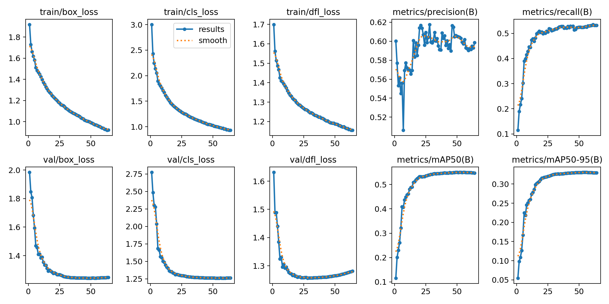

# Southwestern Amazon Basin Model

The Southwestern Amazon Basin model has been created using 21 hours of [soundscape data](https://doi.org/10.5281/zenodo.7079124){ target="_blank" rel="noopener noreferrer" } containing 14,798 bounding box labels representing 132 different species.

---

## Training Results

The following figure illustrates various data that has been recorded during training.
The metrics have been computed after each epoch with the evaluation split of the dataset.

Note: The model weights that generated the maximum value in metrics/mAP50-95 have been used for the final model.

---

## Species Distribution Across Splits

The following table shows the amount of annotations in total and for each species as described in [Dataset Splits](index.md#dataset-splits).

| Species | Train | Val | Test | Total | 70/15/15 Quality {: data-sort-method="mixed-split" } |
| :--- | :---: | :---: | :---: | :---: | :--- |
| ***Total*** | ***79,086*** | ***17,126*** | ***16,889*** | ***113,101*** | ***69.9/15.1/14.9*** {: data-sort-method="none" } |
| ???? | 5,481 | 1,193 | 1,152 | 7,826 | 70.0/15.2/14.7 |
| amabaw1 | 391 | 85 | 89 | 565 | 69.2/15.0/15.8 |
| amapyo1 | 303 | 68 | 63 | 434 | 69.8/15.7/14.5 |
| baffal1 | 868 | 195 | 190 | 1,253 | 69.3/15.6/15.2 |
| bartin2 | 238 | 57 | 50 | 345 | 69.0/16.5/14.5 |
| blbthr1 | 983 | 209 | 224 | 1,416 | 69.4/14.8/15.8 |
| blcbec1 | 113 | 24 | 28 | 165 | 68.5/14.5/17.0 |
| blfant1 | 4,185 | 902 | 906 | 5,993 | 69.8/15.1/15.1 |
| blfcot1 | 98 | 22 | 22 | 142 | 69.0/15.5/15.5 |
| blfjac1 | 212 | 76 | 54 | 342 | 62.0/22.2/15.8 |
| blfnun1 | 187 | 41 | 41 | 269 | 69.5/15.2/15.2 |
| bltant2 | 177 | 24 | 29 | 230 | 77.0/10.4/12.6 |
| blttro1 | 634 | 133 | 141 | 908 | 69.8/14.6/15.5 |
| bsbeye1 | 198 | 49 | 43 | 290 | 68.3/16.9/14.8 |
| bubgro2 | 1,066 | 230 | 221 | 1,517 | 70.3/15.2/14.6 |
| bubwre1 | 3,045 | 654 | 669 | 4,368 | 69.7/15.0/15.3 |
| bucmot4 | 1,498 | 319 | 328 | 2,145 | 69.8/14.9/15.3 |
| buffal1 | 148 | 27 | 41 | 216 | 68.5/12.5/19.0 |
| butsal1 | 579 | 122 | 136 | 837 | 69.2/14.6/16.2 |
| butwoo1 | 1,744 | 381 | 379 | 2,504 | 69.6/15.2/15.1 |
| chwfog1 | 139 | 32 | 39 | 210 | 66.2/15.2/18.6 |
| cintin1 | 1,458 | 304 | 306 | 2,068 | 70.5/14.7/14.8 |
| citwoo1 | 649 | 133 | 145 | 927 | 70.0/14.3/15.6 |
| coffal1 | 111 | 16 | 26 | 153 | 72.5/10.5/17.0 |
| coltro1 | 479 | 95 | 110 | 684 | 70.0/13.9/16.1 |
| cowpar1 | 231 | 64 | 61 | 356 | 64.9/18.0/17.1 |
| crfgle1 | 149 | 29 | 29 | 207 | 72.0/14.0/14.0 |
| ducatt1 | 92 | 32 | 16 | 140 | 65.7/22.9/11.4 |
| ducfly | 174 | 44 | 33 | 251 | 69.3/17.5/13.1 |
| ducgre1 | 1,310 | 308 | 364 | 1,982 | 66.1/15.5/18.4 |
| dutant2 | 728 | 182 | 161 | 1,071 | 68.0/17.0/15.0 |
| elewoo1 | 119 | 29 | 32 | 180 | 66.1/16.1/17.8 |
| fasant1 | 563 | 149 | 124 | 836 | 67.3/17.8/14.8 |
| fepowl | 121 | 25 | 29 | 175 | 69.1/14.3/16.6 |
| gilbar1 | 63 | 31 | 14 | 108 | 58.3/28.7/13.0 |
| gocspa1 | 272 | 61 | 44 | 377 | 72.1/16.2/11.7 |
| goeant1 | 778 | 162 | 151 | 1,091 | 71.3/14.8/13.8 |
| grasal3 | 346 | 72 | 72 | 490 | 70.6/14.7/14.7 |
| greant1 | 370 | 81 | 86 | 537 | 68.9/15.1/16.0 |
| greibi1 | 97 | 39 | 12 | 148 | 65.5/26.4/8.1 |
| grfdov1 | 2,478 | 535 | 579 | 3,592 | 69.0/14.9/16.1 |
| gryant1 | 179 | 36 | 43 | 258 | 69.4/14.0/16.7 |
| gryant2 | 1,426 | 327 | 331 | 2,084 | 68.4/15.7/15.9 |
| hauthr1 | 12,374 | 2,843 | 2,845 | 18,062 | 68.5/15.7/15.8 |
| horscr1 | 259 | 52 | 54 | 365 | 71.0/14.2/14.8 |
| littin1 | 2,077 | 436 | 437 | 2,950 | 70.4/14.8/14.8 |
| lobwoo1 | 518 | 117 | 109 | 744 | 69.6/15.7/14.7 |
| lowant1 | 461 | 92 | 92 | 645 | 71.5/14.3/14.3 |
| meapar | 1,430 | 316 | 287 | 2,033 | 70.3/15.5/14.1 |
| partan1 | 453 | 105 | 102 | 660 | 68.6/15.9/15.5 |
| pirfly1 | 3,726 | 870 | 794 | 5,390 | 69.1/16.1/14.7 |
| pluant1 | 1,082 | 226 | 234 | 1,542 | 70.2/14.7/15.2 |
| plupig2 | 1,394 | 318 | 301 | 2,013 | 69.2/15.8/15.0 |
| plwant1 | 464 | 104 | 100 | 668 | 69.5/15.6/15.0 |
| putfru1 | 498 | 107 | 102 | 707 | 70.4/15.1/14.4 |
| pygant1 | 298 | 63 | 66 | 427 | 69.8/14.8/15.5 |
| rebmac2 | 110 | 28 | 20 | 158 | 69.6/17.7/12.7 |
| rinant2 | 122 | 27 | 26 | 175 | 69.7/15.4/14.9 |
| rinwoo1 | 83 | 17 | 19 | 119 | 69.7/14.3/16.0 |
| ruboro1 | 1,050 | 219 | 216 | 1,485 | 70.7/14.7/14.5 |
| rudpig | 539 | 135 | 112 | 786 | 68.6/17.2/14.2 |
| rufant3 | 842 | 178 | 176 | 1,196 | 70.4/14.9/14.7 |
| ruqdov | 181 | 32 | 43 | 256 | 70.7/12.5/16.8 |
| scrpih1 | 2,215 | 469 | 458 | 3,142 | 70.5/14.9/14.6 |
| sobcac1 | 361 | 92 | 80 | 533 | 67.7/17.3/15.0 |
| spigua1 | 167 | 41 | 36 | 244 | 68.4/16.8/14.8 |
| spwant2 | 1,262 | 281 | 277 | 1,820 | 69.3/15.4/15.2 |
| strcuc1 | 278 | 36 | 0 | 314 | 88.5/11.5/0.0 |
| strwoo2 | 537 | 125 | 116 | 778 | 69.0/16.1/14.9 |
| tabsco1 | 165 | 36 | 37 | 238 | 69.3/15.1/15.5 |
| thlwre1 | 3,958 | 850 | 872 | 5,680 | 69.7/15.0/15.4 |
| undtin1 | 1,225 | 263 | 261 | 1,749 | 70.0/15.0/14.9 |
| viotro3 | 465 | 90 | 88 | 643 | 72.3/14.0/13.7 |
| wespuf1 | 72 | 15 | 16 | 103 | 69.9/14.6/15.5 |
| whbtot1 | 118 | 23 | 29 | 170 | 69.4/13.5/17.1 |
| whnrob1 | 512 | 117 | 117 | 746 | 68.6/15.7/15.7 |
| whrsir1 | 120 | 27 | 26 | 173 | 69.4/15.6/15.0 |
| whttou1 | 1,727 | 374 | 358 | 2,459 | 70.2/15.2/14.6 |
| whwbec1 | 1,258 | 274 | 243 | 1,775 | 70.9/15.4/13.7 |
| wibpip1 | 293 | 68 | 67 | 428 | 68.5/15.9/15.7 |
| yemfly1 | 219 | 48 | 51 | 318 | 68.9/15.1/16.0 |
| yercac1 | 96 | 15 | 9 | 120 | 80.0/12.5/7.5 |
| astgna1 | 42 | 0 | 0 | 42 | Train-only |
| barant1 | 4 | 0 | 0 | 4 | Train-only |
| batman1 | 11 | 0 | 0 | 11 | Train-only |
| blacar1 | 31 | 0 | 0 | 31 | Train-only |
| blctro1 | 34 | 0 | 0 | 34 | Train-only |
| blgdov1 | 5 | 0 | 0 | 5 | Train-only |
| blhpar1 | 86 | 0 | 0 | 86 | Train-only |
| bobfly1 | 58 | 0 | 0 | 58 | Train-only |
| brratt1 | 64 | 0 | 0 | 64 | Train-only |
| btfgle1 | 2 | 0 | 0 | 2 | Train-only |
| cinmou1 | 89 | 0 | 0 | 89 | Train-only |
| compot1 | 14 | 0 | 0 | 14 | Train-only |
| duhpar | 18 | 0 | 0 | 18 | Train-only |
| eulfly1 | 3 | 0 | 0 | 3 | Train-only |
| forela1 | 47 | 0 | 0 | 47 | Train-only |
| garkin1 | 3 | 0 | 0 | 3 | Train-only |
| gnbtro1 | 24 | 0 | 0 | 24 | Train-only |
| gogwoo1 | 10 | 0 | 0 | 10 | Train-only |
| gramou1 | 80 | 0 | 0 | 80 | Train-only |
| grcfly1 | 8 | 0 | 0 | 8 | Train-only |
| gretin1 | 46 | 0 | 0 | 46 | Train-only |
| gycfly1 | 6 | 0 | 0 | 6 | Train-only |
| gycwor1 | 48 | 0 | 0 | 48 | Train-only |
| letbar1 | 73 | 0 | 0 | 73 | Train-only |
| litwoo2 | 11 | 0 | 0 | 11 | Train-only |
| muswre2 | 23 | 0 | 0 | 23 | Train-only |
| olioro1 | 36 | 0 | 0 | 36 | Train-only |
| oliwoo1 | 55 | 0 | 0 | 55 | Train-only |
| pavpig2 | 91 | 0 | 0 | 91 | Train-only |
| plbwoo1 | 26 | 0 | 0 | 26 | Train-only |
| pltant1 | 57 | 0 | 0 | 57 | Train-only |
| puteup1 | 28 | 0 | 0 | 28 | Train-only |
| rcatan1 | 4 | 0 | 0 | 4 | Train-only |
| renwoo1 | 71 | 0 | 0 | 71 | Train-only |
| rinkin1 | 12 | 0 | 0 | 12 | Train-only |
| royfly1 | 2 | 0 | 0 | 2 | Train-only |
| rucant2 | 13 | 0 | 0 | 13 | Train-only |
| ruftof1 | 8 | 0 | 0 | 8 | Train-only |
| scapig2 | 15 | 0 | 0 | 15 | Train-only |
| scbwoo5 | 21 | 0 | 0 | 21 | Train-only |
| specha3 | 38 | 0 | 0 | 38 | Train-only |
| squcuc1 | 7 | 0 | 0 | 7 | Train-only |
| stbwoo2 | 71 | 0 | 0 | 71 | Train-only |
| strxen1 | 3 | 0 | 0 | 3 | Train-only |
| stwqua1 | 27 | 0 | 0 | 27 | Train-only |
| whcspa1 | 63 | 0 | 0 | 63 | Train-only |
| whfant2 | 34 | 0 | 0 | 34 | Train-only |
| whltyr1 | 21 | 0 | 0 | 21 | Train-only |
| whtwoo2 | 45 | 0 | 0 | 45 | Train-only |
| yectyr1 | 2 | 0 | 0 | 2 | Train-only |
| yetwoo2 | 7 | 0 | 0 | 7 | Train-only |
