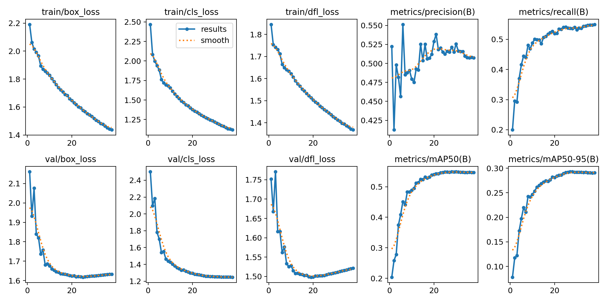

# Hawaii Model

The Hawaii model has been created using almost 51 hours of [soundscape data](https://doi.org/10.5281/zenodo.7078499){ target="_blank" rel="noopener noreferrer" } containing 59,583 bounding box labels representing 27 different species.

---

## Training Results

The following figure illustrates various data that has been recorded during training.
The metrics have been computed after each epoch with the evaluation split of the dataset.

!!! info "Model Checkpoint"
    The weights that produced the highest `metrics/mAP50-95` on the validation split were selected for the final model.

---

## Species Distribution Across Splits

The following table shows the amount of annotations in total and for each species as described in [Dataset Splits](overview.md#dataset-splits).

| Species | Train | Val | Test | Total | 70/15/15 Quality {: data-sort-method="mixed-split" } |
| :--- | :---: | :---: | :---: | :---: | :--- |
| ***Total*** | ***63,261*** | ***13,388*** | ***13,562*** | ***90,211*** | ***70.1/14.8/15.0*** {: data-sort-method="none" } |
| akepa1 | 962 | 199 | 209 | 1,370 | 70.2/14.5/15.3 |
| apapan | 7,265 | 1,544 | 1,482 | 10,291 | 70.6/15.0/14.4 |
| barpet | 598 | 117 | 130 | 845 | 70.8/13.8/15.4 |
| calqua | 89 | 19 | 20 | 128 | 69.5/14.8/15.6 |
| elepai | 219 | 49 | 40 | 308 | 71.1/15.9/13.0 |
| ercfra | 5,269 | 1,162 | 1,282 | 7,713 | 68.3/15.1/16.6 |
| hawama | 10,616 | 2,157 | 2,251 | 15,024 | 70.7/14.4/15.0 |
| hawcre | 897 | 230 | 194 | 1,321 | 67.9/17.4/14.7 |
| hawhaw | 254 | 51 | 54 | 359 | 70.8/14.2/15.0 |
| hawpet1 | 790 | 188 | 193 | 1,171 | 67.5/16.1/16.5 |
| houfin | 5,011 | 1,110 | 997 | 7,118 | 70.4/15.6/14.0 |
| iiwi | 8,695 | 1,847 | 1,800 | 12,342 | 70.5/15.0/14.6 |
| jabwar | 422 | 96 | 61 | 579 | 72.9/16.6/10.5 |
| melthr | 1,209 | 226 | 283 | 1,718 | 70.4/13.2/16.5 |
| norcar | 231 | 57 | 51 | 339 | 68.1/16.8/15.0 |
| omao | 2,812 | 580 | 643 | 4,035 | 69.7/14.4/15.9 |
| reblei | 6,093 | 1,247 | 1,333 | 8,673 | 70.3/14.4/15.4 |
| skylar | 7,457 | 1,584 | 1,603 | 10,644 | 70.1/14.9/15.1 |
| warwhe1 | 3,889 | 849 | 866 | 5,604 | 69.4/15.1/15.5 |
| wiltur | 77 | 19 | 18 | 114 | 67.5/16.7/15.8 |
| yefcan | 242 | 57 | 52 | 351 | 68.9/16.2/14.8 |
| blkfra | 6 | 0 | 0 | 6 | Train-only |
| chukar | 86 | 0 | 0 | 86 | Train-only |
| comwax | 15 | 0 | 0 | 15 | Train-only |
| hawgoo | 3 | 0 | 0 | 3 | Train-only |
| kalphe | 17 | 0 | 0 | 17 | Train-only |
| palila | 37 | 0 | 0 | 37 | Train-only |