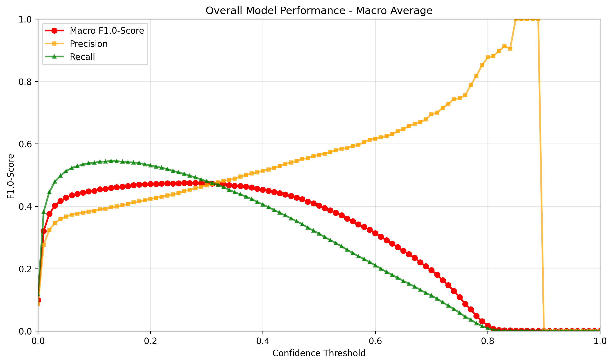
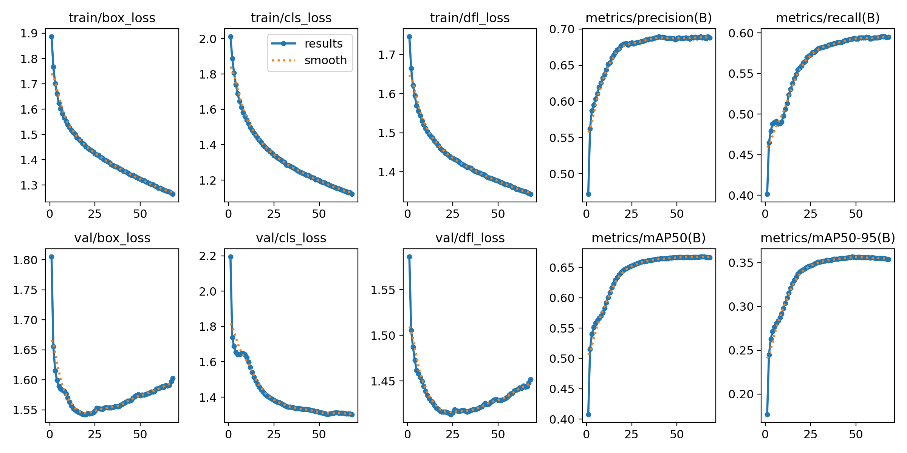

# Just Bird Model - Zero Shot Transfer

The Just Bird model is unique in that testing was not conducted on the same dataset used for training and validation.
We can therefore call this process zero-shot object detection [[2]](#ref-bansal).

The Just Bird model has been trained and evaluated on:

- [Southwestern Amazon Basin](https://doi.org/10.5281/zenodo.7079124){ target="_blank" rel="noopener noreferrer" }
- [Island of Hawai'i](https://doi.org/10.5281/zenodo.7078499){ target="_blank" rel="noopener noreferrer" }
- [Northeastern United States](https://doi.org/10.5281/zenodo.7079380){ target="_blank" rel="noopener noreferrer" }
- [Southern Sierra Nevada mountain range](https://doi.org/10.5281/zenodo.7525805){ target="_blank" rel="noopener noreferrer" }

The testing and therefore the computation of the final metrics was conducted on:

- [Western United States](https://doi.org/10.5281/zenodo.7050014){ target="_blank" rel="noopener noreferrer" }

---

## Precision, Recall and F1-Score

The graphs below show the performance of the model on the **testset** under different confidence thresholds.
The measured metrics are precision, recall and the F1-score.
If we want to optimize the F1-score for the model, one should thus pick a confidence-threshold-value around 0.3.

Note: The rising recall from confidence values 0 to about 0.1 is unusual but by design.
The merging algorithm leads to imprecise merged boxes at low confidence thresholds.
For further details see [How it works](../how-it-works/index.md).

---

## Training Results

The following figure illustrates various data that has been recorded during training.
The metrics have been computed after each epoch with the evaluation split of the dataset.

Note: The model weights that generated the maximum value in metrics/mAP50-95 have been used for the final model.

---

## Species Distribution Across Splits

The following table shows the amount of annotations in total and for each species as described in [Dataset Splits](index.md#dataset-splits).

| Species | Train | Val | Test | Total | 70/15/15 Quality {: data-sort-method="mixed-split" } |
| :--- | :---: | :---: | :---: | :---: | :--- |
| bird | 310,271 | 137,864 | 79,629 | 527,764 | 58.8/26.1/15.1 |

---

## References

[2] Bansal, A., Sikka, K., et al. (2018). "Zero-shot object detection." Proceedings of the European Conference on Computer Vision (ECCV), 384–400.