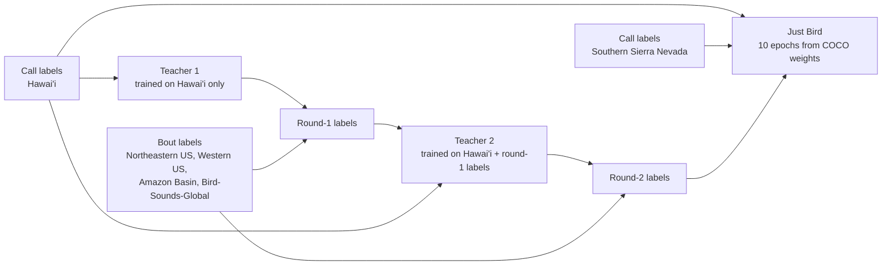

# Just Bird Model

The Just Bird model has a single class, `bird`. It finds bird vocalizations of any species and draws a tight box around each call. Detections are merged with [window fusion](../cli/detect-birds.md#window-fusion-just-bird-default) by default, which also joins same-band boxes less than 0.05 s apart into one phrase box (`--phrase-gap`, `0` keeps one box per call).

The current model was released on 20 October 2026 and replaces the March 2026 model.

---

## Training Data

The model was trained on all five regional datasets and on Bird-Sounds-Global:

- [Southwestern Amazon Basin](https://doi.org/10.5281/zenodo.7079124){ target="_blank" rel="noopener noreferrer" }
- [Island of Hawai'i](https://doi.org/10.5281/zenodo.7078499){ target="_blank" rel="noopener noreferrer" }
- [Northeastern United States](https://doi.org/10.5281/zenodo.7079380){ target="_blank" rel="noopener noreferrer" }
- [Southern Sierra Nevada mountain range](https://doi.org/10.5281/zenodo.7525805){ target="_blank" rel="noopener noreferrer" }
- [Western United States](https://doi.org/10.5281/zenodo.7050014){ target="_blank" rel="noopener noreferrer" }
- Bird-Sounds-Global: annotated soundscapes from [xeno-canto](https://xeno-canto.org){ target="_blank" rel="noopener noreferrer" } (Lifeplan and SystemShift projects) from many countries

**Labels.** Hawai'i and Southern Sierra Nevada are annotated per call. The other datasets mostly put one box around a whole song or bout. Their boxes were split into single-call boxes in two rounds of self-training: a model trained on call-level labels proposed the call boxes inside each human box. Clips that still contained an unsplit human box were left out. [Training Recipe](#training-recipe) shows how this was done and why.

**Recipe.** YOLO11s, started from the COCO weights, trained for 10 epochs on PCEN spectrograms. The learning rate decays to its final value within those 10 epochs, and mixup augmentation is switched off for the last 3 (mosaic augmentation is not used). There is no early stopping.

---

## Performance on an Unseen Site

Because the model was trained on every dataset, none of them is left to test it on recordings from a site it has not seen. The transfer was therefore measured with the same recipe trained without Southern Sierra Nevada and then run on the full Southern Sierra Nevada recordings, a zero-shot test in the sense of [[2]](#ref-bansal). The previous model's recipe was retrained and tested in the same way.

Event F1 on full recordings with window fusion (including the removal of nested boxes, phrase gap off):

| Recipe | IoU 0.25 | IoU 0.5 | IoU 0.75 | IoU 0.5 at the threshold chosen on Hawai'i val |
| :--- | :---: | :---: | :---: | :---: |
| Current | **0.540** | **0.385** | **0.116** | **0.384** |
| Previous (March 2026) | 0.463 | 0.278 | 0.059 | 0.249 |

The graph shows precision, recall and F1 at IoU 0.5 for every confidence threshold. The curves come from the model trained without Southern Sierra Nevada, not from the released weights, which were trained on it. The dashed line is the previous recipe retrained the same way, not the March 2026 model.

- **Confidence threshold:** **0.15**, the default in `detect_birds.py` and the [Demo](../demo.md). The best threshold on the Hawai'i validation recordings is 0.13 to 0.15, and it carries over to the unseen site with almost no loss (0.384 against the best 0.385).
- **Phrase gap:** some Southern Sierra Nevada labels box a whole phrase where the model boxes single syllables, which lowers the scores at IoU 0.5 and above. The default phrase gap of 0.05 s raises F1 at IoU 0.5 there from 0.385 to 0.396, and on song-labelled Western-US validation minutes from 0.170 to 0.197. On call-level labels it costs about 0.05 (Hawai'i val: 0.581 to 0.531). If your annotations box single calls, pass `--phrase-gap 0`. [Phrase boxes](../cli/detect-birds.md#window-fusion-just-bird-default) has the numbers for other gaps.
- **In-domain:** on the full Hawai'i validation recordings, the released model reaches F1 0.590 at IoU 0.5 (threshold 0.14, phrase gap off).

---

## Training Recipe

The recipe was worked out on the same hold-out: every model in this section was trained without Southern Sierra Nevada and tested on its full recordings, as in [Performance on an Unseen Site](#performance-on-an-unseen-site). The released model repeats the last step with Southern Sierra Nevada added.

```mermaid
flowchart LR
  hawaii["Call labels<br/>Hawai'i"]
  ssn["Call labels<br/>Southern Sierra Nevada"]
  bouts["Bout labels<br/>Northeastern US, Western US,<br/>Amazon Basin, Bird-Sounds-Global"]
  t1["Teacher 1<br/>trained on Hawai'i only"]
  r1["Round-1 labels"]
  t2["Teacher 2<br/>trained on Hawai'i + round-1 labels"]
  r2["Round-2 labels"]
  final["Just Bird<br/>10 epochs from COCO weights"]
  hawaii --> t1 --> r1
  bouts --> r1 --> t2 --> r2
  bouts --> r2
  hawaii --> t2
  hawaii --> final
  ssn --> final
  r2 --> final
```

### Splitting Bouts into Calls

Trained on the human labels of all datasets, the model learns the bout style and draws boxes of several seconds on a new site. It then scores lower there than a model trained on Hawai'i alone (see the first two bars [below](#each-step-on-the-unseen-site)). The bout labels are therefore split into calls before the final training. A teacher model looks for calls inside each human box, and the call boxes it finds replace the box:

- **Round 1** uses a teacher trained on Hawai'i only, which never saw a bout box.
- **Round 2** uses a teacher trained on all sets with the round-1 labels, and splits the original human boxes again.

[How the Labels Are Split](#how-the-labels-are-split) explains the rule, what each round changes, and which boxes cannot be split.

### Each Step on the Unseen Site

- **More data needs better labels.** The bout-labelled datasets with their human labels lower F1 from 0.280 to 0.122. With split labels the same data raises it to 0.380–0.384.
- **Round 2** ties round 1 on full recordings. It is kept because it leaves out less data, scores higher on 3 s clips (F1 0.368 against 0.343 at IoU 0.5, both trained on a quarter of the data), and its threshold transfers: the one chosen on Hawai'i val loses almost nothing on the new site (0.384 against the best 0.385; round 1: 0.380 against 0.393).
- **The previous recipe** trained on the human labels for up to 100 epochs, with early stopping and augmentation from a hyperparameter search.

### Ten Epochs

Training longer does not help a new site. In a 30-epoch run, F1 on the unseen site is 0.361 after the first epoch and about 0.38 from epoch 6 on, then slowly declines, while Hawai'i val holds at 0.585–0.588. The checkpoints before epoch 30 are taken before that run's learning rate has decayed. The 10-epoch run decays fully within its 10 epochs and scores best on the unseen site (0.385). Early stopping on Hawai'i val cannot see this, so the recipe uses a fixed 10 epochs.

### Training Curves of the Rounds

Teacher 1 was trained for up to 100 epochs with early stopping and kept epoch 24. Teacher 2 and the final recipe run a fixed schedule that decays fully and keep the last epoch. On Hawai'i val the three end within about 0.03 mAP50 of each other (0.63–0.66). Only the unseen site separates them.

---

## How the Labels Are Split

The refinement changes only the four bout-labelled datasets: Northeastern US, Western US, Amazon Basin and Bird-Sounds-Global. Hawai'i and Southern Sierra Nevada keep their human call labels. It works on the training images, 3 s clips that overlap by half. An annotation longer than a clip is cut into one box per clip, and each of these boxes is refined on its own.

### The Rule

For every clip:

1. The teacher proposes boxes with a confidence of at least 0.05. The cutoff is low on purpose: inside a box a human drew, even a weak detection is likely a call.
2. A teacher box counts as inside a human box when at least half of the teacher box lies within it. The share is measured on the teacher box, so a bout box can take many small call boxes. A teacher box that overlaps several human boxes counts only for those that hold at least half of it.
3. The teacher boxes inside a human box replace it and are clipped to it, so a refined box never leaves the time and frequency range the annotator marked.
4. Near-duplicates (IoU ≥ 0.6, for example one call inside two overlapping human boxes) are merged, keeping the more confident box.
5. A human box with no teacher box inside stays unchanged: it is **unsplit**. Every clip that still holds an unsplit box is left out of training, so no bout box reaches the model.

The top row shows boxes that are split. A bout box becomes five call boxes. A call box that already fits its call is replaced by an almost identical box. A loose call box becomes a tighter one. The bottom row shows the reasons a box stays unsplit, covered in [Why Boxes Stay Unsplit](#why-boxes-stay-unsplit).

Two things the rule cannot do:

- **It never adds a label.** A call outside every human box stays unlabelled, as in the original data.
- **A call the teacher misses inside a bout box loses its label**, because the call boxes replace the whole bout box. In the bout clip above, the short, low sound at about 0.45 s gets no box in either round and now counts as background. A lower confidence cutoff would find more of these calls, but would also accept more noise.

### What Each Round Changes

Round 1 cuts the median box length from 1.15–3.0 s to 0.43–1.16 s, and round 2 to 0.38–0.82 s, close to the 0.50 s of the call-level Hawai'i labels. The larger effect of round 2 is that it splits more of the bouts, so far fewer clips are left out:

| Dataset | Training clips | Left out, round 1 | Left out, round 2 | Used for training |
| :--- | :---: | :---: | :---: | :---: |
| Northeastern US | 116,780 | 25,847 (22%) | 10,617 (9%) | 106,163 |
| Western US | 36,435 | 13,605 (37%) | 9,014 (25%) | 27,421 |
| Amazon Basin | 31,264 | 23,730 (76%) | 18,101 (58%) | 13,163 |
| Bird-Sounds-Global | 84,404 | 23,826 (28%) | 15,334 (18%) | 69,070 |

Amazon Basin loses the most. Its recordings are dense choruses with long, overlapping annotations, and even after round 2 more than half of its clips still hold an unsplit box.

### Why Boxes Stay Unsplit

An unsplit box is not a box the teacher judged to be correct. A call box that already fits its call is not unsplit: if the teacher finds the call, its box replaces the human box and is about the same (the second clip above). A box stays unsplit only when no teacher box lies at least half inside it, which happens in two ways:

- **No teacher box.** The teacher finds nothing in the box. Usually this is a stretch of a long annotation where the bird is silent or barely audible in this clip, or a faint call.
- **The teacher box sticks out.** Teacher boxes touch the human box, but less than half of each lies inside it. This happens where boxes of several birds overlap, as in the Amazon Basin choruses. It also happens where the teacher draws a larger box around a call than the annotator did.

The second case means that a good call box can still stay unsplit. To measure how often, every unsplit box was traced back to the whole annotation it was cut from, and the teacher was run again on its clip:

| Dataset | Human boxes | From call-sized annotations (≤ 0.5 s) | Unsplit, all boxes | Unsplit, call-sized | Call-sized share of the unsplit boxes |
| :--- | :---: | :---: | :---: | :---: | :---: |
| Northeastern US | 151,983 | 5,423 (3.6%) | 7% | 22% | 11% |
| Western US | 54,951 | 316 (0.6%) | 19% | 70% | 2% |
| Amazon Basin | 77,792 | 733 (0.9%) | 34% | 74% | 2% |
| Bird-Sounds-Global | 125,370 | 8,467 (6.8%) | 15% | 31% | 14% |
| All four | 410,096 | 14,939 (3.6%) | 16% | 31% | 7% |

Round 2, training split, boxes counted per 3 s clip. Call-sized means the whole annotation is at most 0.5 s long, the median of the Hawai'i call labels.

- **Call-sized boxes stay unsplit more often** than longer ones: 31% against 16% over all four datasets. In 62% of these cases the teacher did see something, but its box sticks out. The rule is stricter with tight boxes than it needs to be: a teacher box that covers a tight human box and is more than twice its size fails the half-inside test.
- **But call-sized boxes are rare.** These datasets were annotated per bout, and only 3.6% of their boxes come from call-sized annotations. They make up 7% of the unsplit boxes, so leaving their clips out costs little data.
- **Most unsplit boxes are pieces of long annotations.** In 48% of all unsplit boxes the teacher found nothing, mostly silent or faint stretches. In the rest its boxes stick out, above all in Amazon Basin (65% of its unsplit boxes).
- **Leaving these clips out is the safer choice.** Keeping them would put bout boxes back into training, and bout boxes are what lowered F1 on the unseen site from 0.280 to 0.122 (see [Each Step on the Unseen Site](#each-step-on-the-unseen-site)). A rule that also accepts a teacher box covering most of a small human box would keep the call-sized ones. It has not been tested.

---

## Training Results

The figure shows the validation mAP and the box loss after each epoch. The validation set is the Hawai'i and Southern Sierra Nevada val splits, the two datasets with call-level labels. The drop in training loss at epoch 8 is where mixup augmentation is switched off.

!!! info "Model Checkpoint"
    The checkpoint with the best validation fitness was kept. That was the last epoch (10).

---

## Species Distribution Across Splits

The following table shows the number of boxes in the training and validation images, counted per 3 s training image. Consecutive images overlap by 50%, so most calls are counted twice. The training split includes the test splits of all datasets, because the transfer was measured on a held-out site instead (see above).

| Species | Train | Val | Test | Total | 70/15/15 Quality {: data-sort-method="mixed-split" } |
| :--- | :---: | :---: | :---: | :---: | :--- |
| bird | 1,162,238 | 16,755 | 0 | 1,178,993 | 98.6/1.4/0.0 |

---

## References

[2] Bansal, A., Sikka, K., et al. (2018). "Zero-shot object detection." Proceedings of the European Conference on Computer Vision (ECCV), 384–400.
