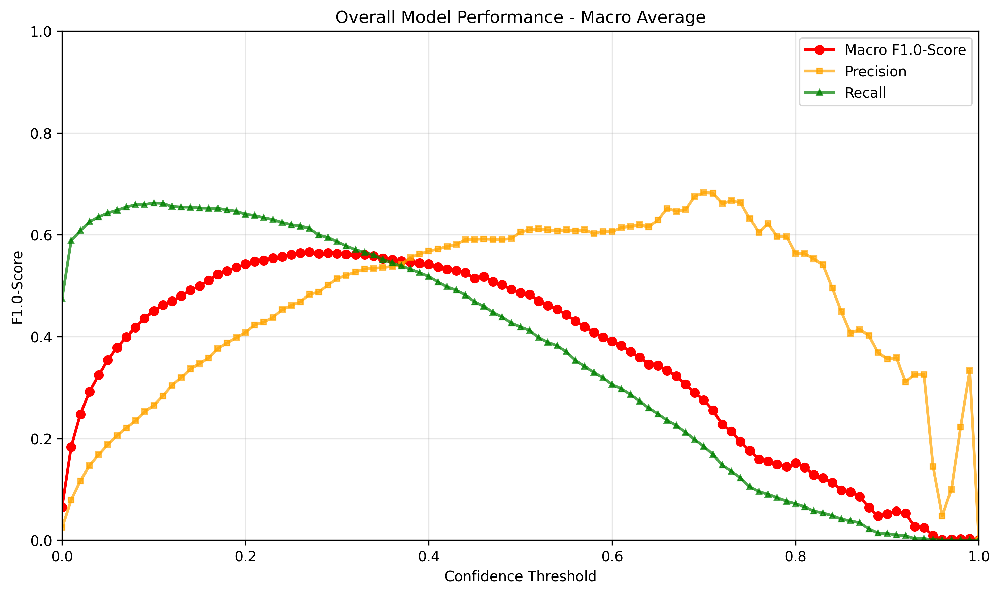
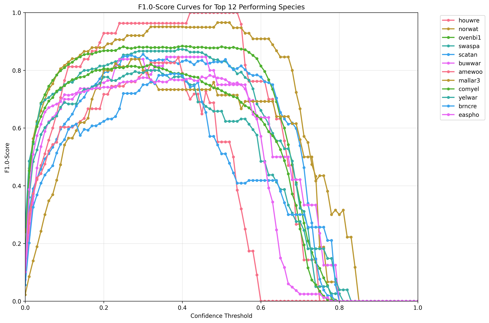
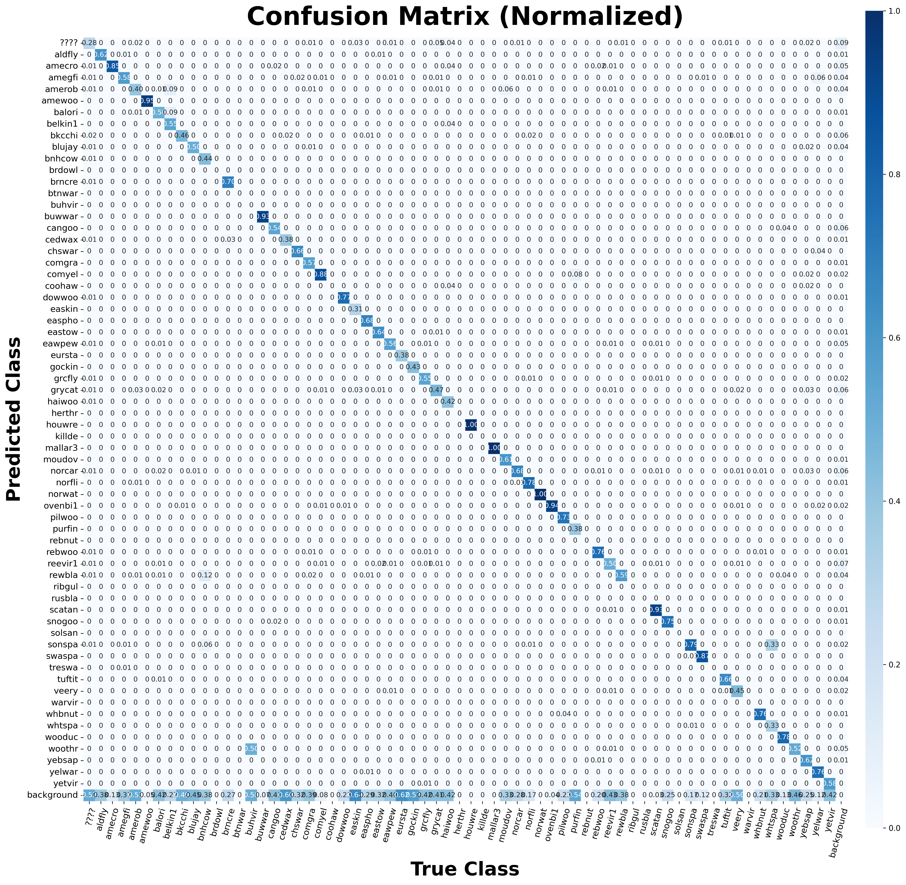
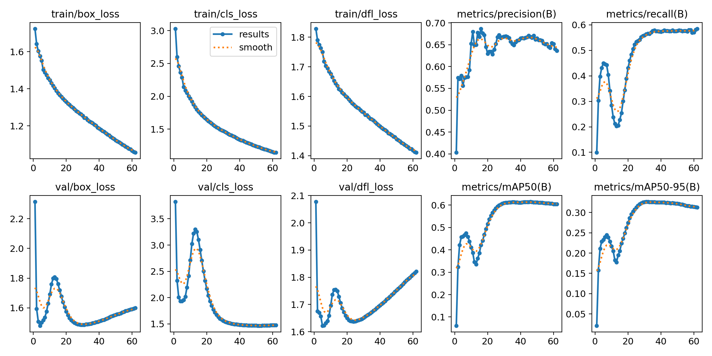

# Northeastern United States Model

The Northeastern United States model has been created using 285 hours of [soundscape data](https://doi.org/10.5281/zenodo.7079380){ target="_blank" rel="noopener noreferrer" } containing 50,760 bounding box labels representing 81 different species.

---

## Precision, Recall and F1-Score

The graphs below show the performance of the model on the **testset** under different confidence thresholds.
The measured metrics are precision, recall and the F1-score.
If we want to optimize the F1-score for the model, one should thus pick a confidence-threshold-value around 0.27.

Note: The rising recall from confidence values 0 to about 0.1 is unusual but by design.
The merging algorithm leads to imprecise merged boxes at low confidence thresholds.
For further details see [How it works](../how-it-works/index.md).

---

## Top Performing Species

The data below shows the F1-score for the best 12 performing species within the test dataset.
This implies that a detection of those species in new unseen data is highly accurate if the confidence threshold is set to around 0.3.

---

## Confusion Matrix

The confusion matrix shows which species labels get mixed with another.
Even though it is messy and hard to read, one can easily see that the most prominent areas are the main diagonal and the background row (lowest).
This illustrates that the model mostly predicts the correct class, but often misses present vocalizations and misclassifies them as background.

---

## Training Results

The following figure illustrates various data that has been recorded during training.
The metrics have been computed after each epoch with the evaluation split of the dataset.

Note: The model weights that generated the maximum value in metrics/mAP50-95 have been used for the final model.

---

## Species Distribution Across Splits

The following table shows the amount of annotations in total and for each species as described in [Dataset Splits](index.md#dataset-splits).

| Species | Train | Val | Test | Total | 70/15/15 Quality {: data-sort-method="mixed-split" } |
| :--- | :---: | :---: | :---: | :---: | :--- |
| ***Total*** | ***151,396*** | ***32,620*** | ***37,279*** | ***221,295*** | ***68.4/14.7/16.8*** {: data-sort-method="none" } |
| ???? | 7,512 | 1,602 | 1,982 | 11,096 | 67.7/14.4/17.9 |
| aldfly | 1,556 | 328 | 333 | 2,217 | 70.2/14.8/15.0 |
| amecro | 6,506 | 1,387 | 1,706 | 9,599 | 67.8/14.4/17.8 |
| amegfi | 6,234 | 1,339 | 1,476 | 9,049 | 68.9/14.8/16.3 |
| amerob | 6,566 | 1,417 | 1,498 | 9,481 | 69.3/14.9/15.8 |
| amewoo | 186 | 41 | 41 | 268 | 69.4/15.3/15.3 |
| balori | 1,734 | 365 | 402 | 2,501 | 69.3/14.6/16.1 |
| belkin1 | 177 | 37 | 40 | 254 | 69.7/14.6/15.7 |
| bkcchi | 9,215 | 1,983 | 2,176 | 13,374 | 68.9/14.8/16.3 |
| blujay | 6,814 | 1,464 | 1,650 | 9,928 | 68.6/14.7/16.6 |
| bnhcow | 160 | 35 | 35 | 230 | 69.6/15.2/15.2 |
| brncre | 328 | 71 | 83 | 482 | 68.0/14.7/17.2 |
| buhvir | 220 | 44 | 39 | 303 | 72.6/14.5/12.9 |
| buwwar | 195 | 43 | 41 | 279 | 69.9/15.4/14.7 |
| cangoo | 7,323 | 1,560 | 2,117 | 11,000 | 66.6/14.2/19.2 |
| cedwax | 958 | 204 | 238 | 1,400 | 68.4/14.6/17.0 |
| chswar | 501 | 109 | 111 | 721 | 69.5/15.1/15.4 |
| comgra | 2,423 | 510 | 532 | 3,465 | 69.9/14.7/15.4 |
| comyel | 3,990 | 864 | 908 | 5,762 | 69.2/15.0/15.8 |
| dowwoo | 1,046 | 222 | 328 | 1,596 | 65.5/13.9/20.6 |
| easkin | 842 | 183 | 178 | 1,203 | 70.0/15.2/14.8 |
| easpho | 2,081 | 463 | 472 | 3,016 | 69.0/15.4/15.6 |
| eastow | 1,249 | 272 | 275 | 1,796 | 69.5/15.1/15.3 |
| eawpew | 6,400 | 1,370 | 1,434 | 9,204 | 69.5/14.9/15.6 |
| eursta | 184 | 40 | 39 | 263 | 70.0/15.2/14.8 |
| gockin | 183 | 37 | 37 | 257 | 71.2/14.4/14.4 |
| grcfly | 2,520 | 540 | 574 | 3,634 | 69.3/14.9/15.8 |
| grycat | 10,133 | 2,182 | 2,351 | 14,666 | 69.1/14.9/16.0 |
| haiwoo | 373 | 77 | 83 | 533 | 70.0/14.4/15.6 |
| houwre | 153 | 34 | 35 | 222 | 68.9/15.3/15.8 |
| mallar3 | 308 | 66 | 72 | 446 | 69.1/14.8/16.1 |
| moudov | 264 | 56 | 61 | 381 | 69.3/14.7/16.0 |
| norcar | 4,861 | 1,452 | 2,864 | 9,177 | 53.0/15.8/31.2 |
| norfli | 1,777 | 384 | 394 | 2,555 | 69.5/15.0/15.4 |
| norwat | 391 | 82 | 82 | 555 | 70.5/14.8/14.8 |
| ovenbi1 | 6,435 | 1,378 | 1,643 | 9,456 | 68.1/14.6/17.4 |
| pilwoo | 412 | 89 | 94 | 595 | 69.2/15.0/15.8 |
| purfin | 190 | 31 | 38 | 259 | 73.4/12.0/14.7 |
| rebwoo | 1,658 | 349 | 396 | 2,403 | 69.0/14.5/16.5 |
| reevir1 | 10,476 | 2,233 | 2,327 | 15,036 | 69.7/14.9/15.5 |
| rewbla | 8,456 | 1,813 | 1,939 | 12,208 | 69.3/14.9/15.9 |
| scatan | 1,809 | 393 | 396 | 2,598 | 69.6/15.1/15.2 |
| snogoo | 271 | 58 | 63 | 392 | 69.1/14.8/16.1 |
| sonspa | 3,956 | 851 | 936 | 5,743 | 68.9/14.8/16.3 |
| swaspa | 1,366 | 262 | 255 | 1,883 | 72.5/13.9/13.5 |
| tuftit | 5,366 | 1,146 | 1,203 | 7,715 | 69.6/14.9/15.6 |
| veery | 3,940 | 845 | 844 | 5,629 | 70.0/15.0/15.0 |
| whbnut | 1,308 | 280 | 294 | 1,882 | 69.5/14.9/15.6 |
| whtspa | 138 | 33 | 28 | 199 | 69.3/16.6/14.1 |
| wooduc | 216 | 49 | 67 | 332 | 65.1/14.8/20.2 |
| woothr | 7,470 | 1,583 | 1,656 | 10,709 | 69.8/14.8/15.5 |
| yebsap | 631 | 139 | 184 | 954 | 66.1/14.6/19.3 |
| yelwar | 579 | 126 | 125 | 830 | 69.8/15.2/15.1 |
| yetvir | 493 | 99 | 104 | 696 | 70.8/14.2/14.9 |
| amered | 4 | 0 | 0 | 4 | Train-only |
| bcnher | 2 | 0 | 0 | 2 | Train-only |
| bkbwar | 45 | 0 | 0 | 45 | Train-only |
| boboli | 19 | 0 | 0 | 19 | Train-only |
| brdowl | 78 | 0 | 0 | 78 | Train-only |
| btnwar | 10 | 0 | 0 | 10 | Train-only |
| comrav | 17 | 0 | 0 | 17 | Train-only |
| coohaw | 71 | 0 | 0 | 71 | Train-only |
| daejun | 16 | 0 | 0 | 16 | Train-only |
| easblu | 20 | 0 | 0 | 20 | Train-only |
| grbher3 | 20 | 0 | 0 | 20 | Train-only |
| herthr | 6 | 0 | 0 | 6 | Train-only |
| hoowar | 43 | 0 | 0 | 43 | Train-only |
| houfin | 33 | 0 | 0 | 33 | Train-only |
| killde | 96 | 0 | 0 | 96 | Train-only |
| naswar | 11 | 0 | 0 | 11 | Train-only |
| pinsis | 6 | 0 | 0 | 6 | Train-only |
| rebnut | 9 | 0 | 0 | 9 | Train-only |
| redcro | 9 | 0 | 0 | 9 | Train-only |
| ribgul | 29 | 0 | 0 | 29 | Train-only |
| robgro | 33 | 0 | 0 | 33 | Train-only |
| ruckin | 6 | 0 | 0 | 6 | Train-only |
| rusbla | 85 | 0 | 0 | 85 | Train-only |
| solsan | 29 | 0 | 0 | 29 | Train-only |
| treswa | 14 | 0 | 0 | 14 | Train-only |
| tunswa | 18 | 0 | 0 | 18 | Train-only |
| warvir | 82 | 0 | 0 | 82 | Train-only |
| yerwar | 52 | 0 | 0 | 52 | Train-only |
