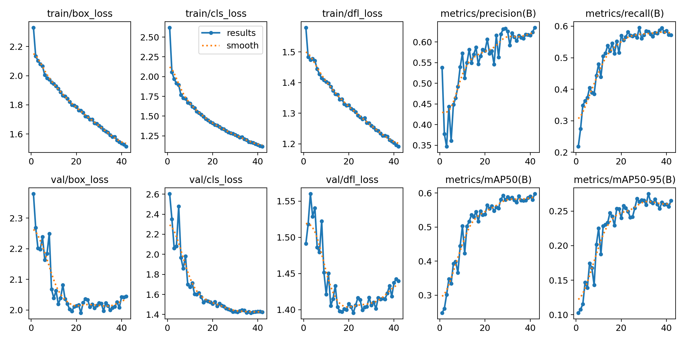

# Southern Sierra Nevada Model

The Southern Sierra Nevada model has been created using almost 17 hours of [soundscape data](https://doi.org/10.5281/zenodo.7525805){ target="_blank" rel="noopener noreferrer" } containing 10,296 bounding box labels representing 21 different species.

---

## Training Results

The following figure illustrates various data that has been recorded during training.
The metrics have been computed after each epoch with the evaluation split of the dataset.

Note: The model weights that generated the maximum value in metrics/mAP50-95 have been used for the final model.

---

## Species Distribution Across Splits

The following table shows the amount of annotations in total and for each species as described in [Dataset Splits](index#dataset-splits).

| Species | Train | Val | Test | Total | 70/15/15 Quality {: data-sort-method="mixed-split" } |
| :--- | :---: | :---: | :---: | :---: | :--- |
| ***Total*** | ***16,528*** | ***3,600*** | ***3,400*** | ***23,528*** | ***70.2/15.3/14.5*** {: data-sort-method="none" } |
| ???? | 1,003 | 214 | 184 | 1,401 | 71.6/15.3/13.1 |
| amepip | 2,757 | 581 | 637 | 3,975 | 69.4/14.6/16.0 |
| amerob | 215 | 45 | 45 | 305 | 70.5/14.8/14.8 |
| clanut | 709 | 151 | 149 | 1,009 | 70.3/15.0/14.8 |
| daejun | 368 | 70 | 81 | 519 | 70.9/13.5/15.6 |
| gcrfin | 1,889 | 411 | 372 | 2,672 | 70.7/15.4/13.9 |
| herthr | 508 | 108 | 104 | 720 | 70.6/15.0/14.4 |
| mouchi | 111 | 23 | 23 | 157 | 70.7/14.6/14.6 |
| rocwre | 1,498 | 319 | 326 | 2,143 | 69.9/14.9/15.2 |
| whcspa | 7,119 | 1,678 | 1,479 | 10,276 | 69.3/16.3/14.4 |
| brebla | 2 | 0 | 0 | 2 | Train-only |
| casfin | 59 | 0 | 0 | 59 | Train-only |
| dusfly | 7 | 0 | 0 | 7 | Train-only |
| foxspa | 64 | 0 | 0 | 64 | Train-only |
| mallar3 | 6 | 0 | 0 | 6 | Train-only |
| moublu | 65 | 0 | 0 | 65 | Train-only |
| norfli | 21 | 0 | 0 | 21 | Train-only |
| orcwar | 16 | 0 | 0 | 16 | Train-only |
| sposan | 53 | 0 | 0 | 53 | Train-only |
| warvir | 18 | 0 | 0 | 18 | Train-only |
| yelwar | 1 | 0 | 0 | 1 | Train-only |
| yerwar | 39 | 0 | 0 | 39 | Train-only |
