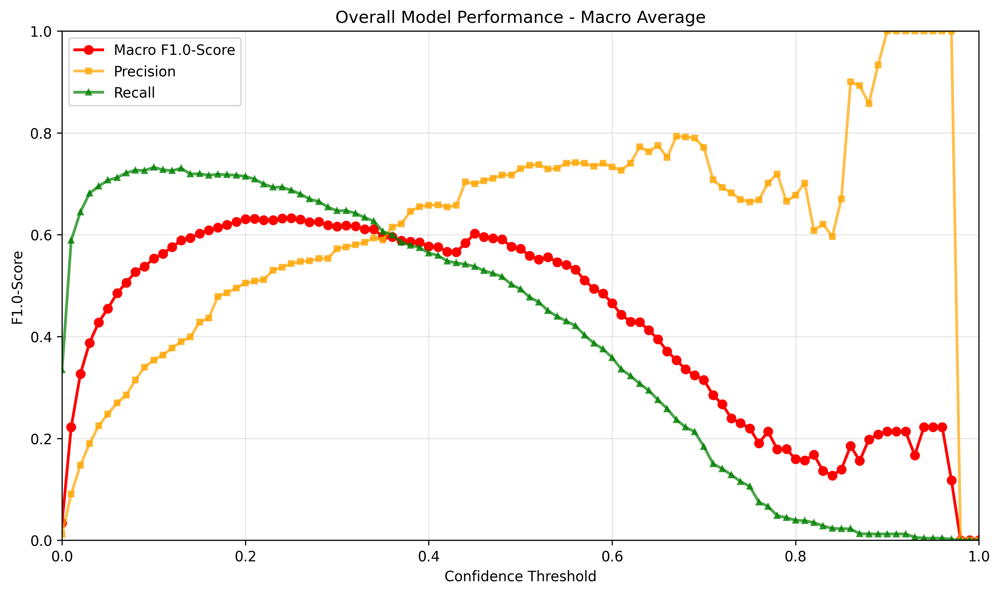
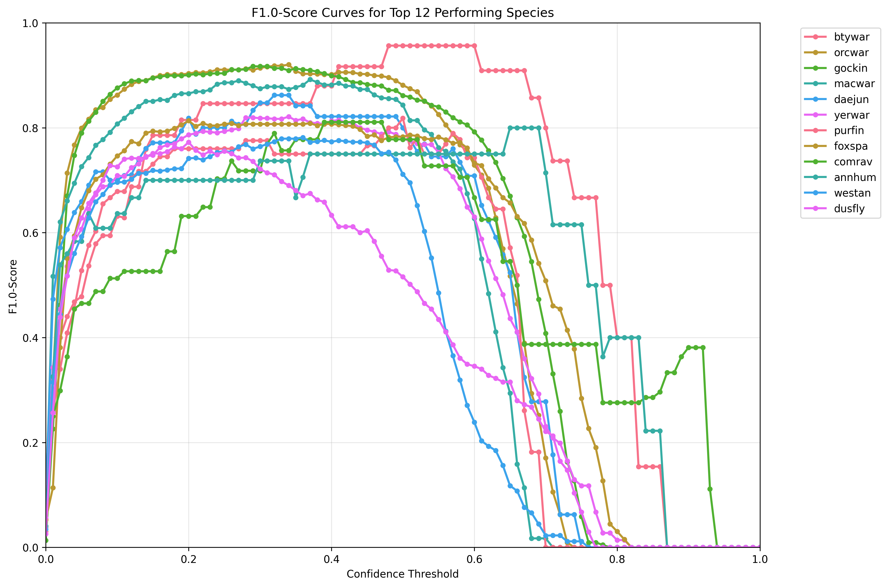
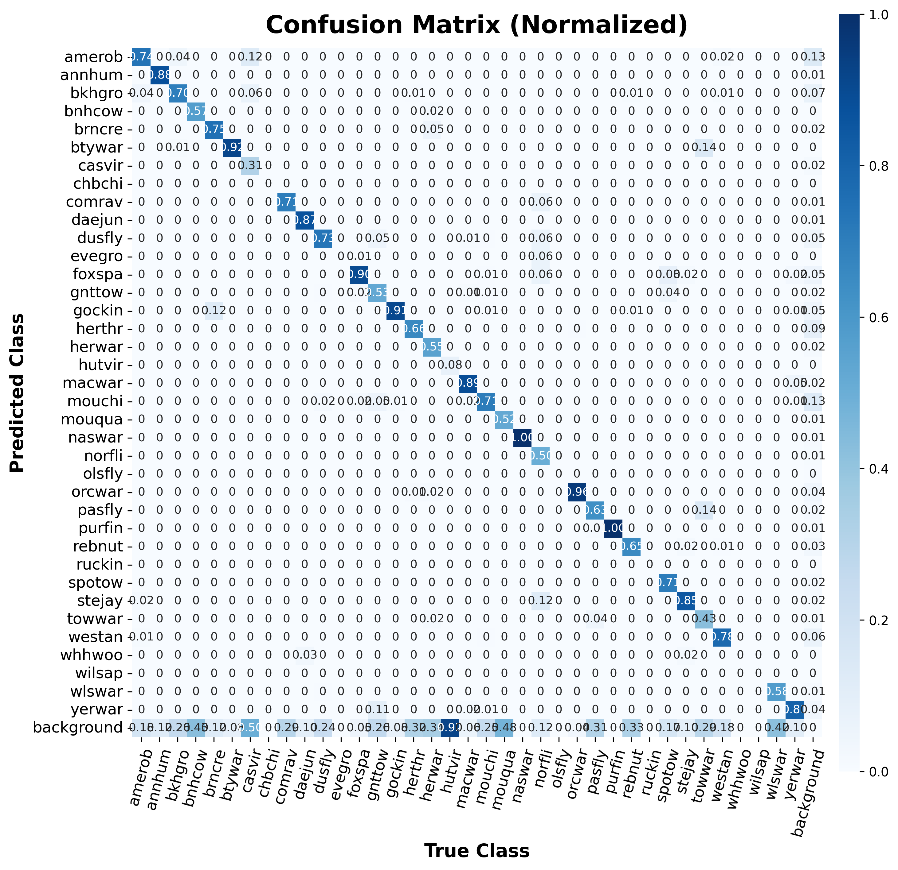
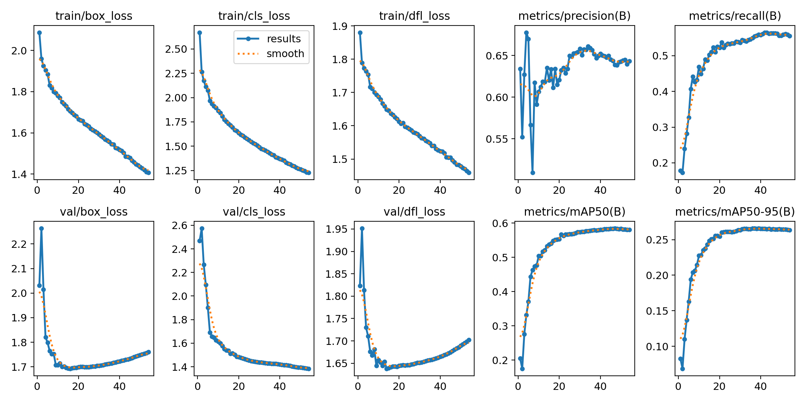

# Western United States Model

The Western United States model has been created using 33 hours of [soundscape data](https://doi.org/10.5281/zenodo.7050014){ target="_blank" rel="noopener noreferrer" } containing 20,147 bounding box labels representing 56 different species.

---

## Precision, Recall and F1-Score

The graphs below show the performance of the model on the **testset** under different confidence thresholds.
The measured metrics are precision, recall and the F1-score.
If we want to optimize the F1-score for the model, one should thus pick a confidence-threshold-value around 0.21.

!!! info "Rising Recall at Low Confidence"
    The rising recall from confidence values 0 to ~0.1 is unusual but by design. At very low confidence thresholds, the merging algorithm produces imprecise merged boxes that can accidentally overlap more ground truth labels. See [How it works](../how-it-works/overview.md) for details.

---

## Top Performing Species

The data below shows the F1-score for the best 12 performing species within the test dataset.
This implies that a detection of those species in new unseen data is highly accurate if the confidence threshold is set to around 0.3.

---

## Confusion Matrix

The confusion matrix shows which species labels get mixed with another.
One can see that the most prominent areas are the main diagonal and the background row (lowest).
This illustrates that the model mostly predicts the correct class, but often misses present vocalizations and misclassifies them as background.

---

## Training Results

The following figure illustrates various data that has been recorded during training.
The metrics have been computed after each epoch with the evaluation split of the dataset.

!!! info "Model Checkpoint"
    The weights that produced the highest `metrics/mAP50-95` on the validation split were selected for the final model.

---

## Species Distribution Across Splits

The following table shows the amount of annotations in total and for each species as described in [Dataset Splits](overview.md#dataset-splits).

| Species | Train | Val | Test | Total | 70/15/15 Quality {: data-sort-method="mixed-split" } |
| :--- | :---: | :---: | :---: | :---: | :--- |
| ***Total*** | ***55,835*** | ***11,946*** | ***11,848*** | ***79,629*** | ***70.1/15.0/14.9*** {: data-sort-method="none" } |
| amerob | 7,333 | 1,574 | 1,560 | 10,467 | 70.1/15.0/14.9 |
| annhum | 85 | 20 | 30 | 135 | 63.0/14.8/22.2 |
| bkhgro | 3,843 | 825 | 838 | 5,506 | 69.8/15.0/15.2 |
| bnhcow | 85 | 17 | 16 | 118 | 72.0/14.4/13.6 |
| brncre | 128 | 30 | 28 | 186 | 68.8/16.1/15.1 |
| btywar | 199 | 53 | 38 | 290 | 68.6/18.3/13.1 |
| casvir | 213 | 52 | 46 | 311 | 68.5/16.7/14.8 |
| comrav | 458 | 101 | 92 | 651 | 70.4/15.5/14.1 |
| daejun | 417 | 87 | 85 | 589 | 70.8/14.8/14.4 |
| dusfly | 2,768 | 583 | 602 | 3,953 | 70.0/14.7/15.2 |
| foxspa | 2,281 | 483 | 489 | 3,253 | 70.1/14.8/15.0 |
| gnttow | 461 | 98 | 103 | 662 | 69.6/14.8/15.6 |
| gockin | 7,350 | 1,547 | 1,563 | 10,460 | 70.3/14.8/14.9 |
| herthr | 5,672 | 1,284 | 1,252 | 8,208 | 69.1/15.6/15.3 |
| herwar | 1,248 | 271 | 270 | 1,789 | 69.8/15.1/15.1 |
| hutvir | 91 | 25 | 28 | 144 | 63.2/17.4/19.4 |
| macwar | 1,511 | 322 | 334 | 2,167 | 69.7/14.9/15.4 |
| mouchi | 6,955 | 1,575 | 1,514 | 10,044 | 69.2/15.7/15.1 |
| mouqua | 581 | 111 | 119 | 811 | 71.6/13.7/14.7 |
| naswar | 136 | 35 | 29 | 200 | 68.0/17.5/14.5 |
| norfli | 219 | 46 | 48 | 313 | 70.0/14.7/15.3 |
| orcwar | 3,230 | 695 | 692 | 4,617 | 70.0/15.1/15.0 |
| pasfly | 858 | 190 | 188 | 1,236 | 69.4/15.4/15.2 |
| purfin | 278 | 59 | 59 | 396 | 70.2/14.9/14.9 |
| rebnut | 2,267 | 476 | 477 | 3,220 | 70.4/14.8/14.8 |
| spotow | 328 | 69 | 69 | 466 | 70.4/14.8/14.8 |
| stejay | 1,259 | 258 | 252 | 1,769 | 71.2/14.6/14.2 |
| towwar | 93 | 25 | 19 | 137 | 67.9/18.2/13.9 |
| westan | 2,506 | 545 | 524 | 3,575 | 70.1/15.2/14.7 |
| wlswar | 203 | 37 | 46 | 286 | 71.0/12.9/16.1 |
| yerwar | 2,137 | 453 | 438 | 3,028 | 70.6/15.0/14.5 |
| acowoo | 57 | 0 | 0 | 57 | Train-only |
| amegfi | 3 | 0 | 0 | 3 | Train-only |
| batpig1 | 28 | 0 | 0 | 28 | Train-only |
| bewwre | 4 | 0 | 0 | 4 | Train-only |
| cangoo | 81 | 0 | 0 | 81 | Train-only |
| casfin | 24 | 0 | 0 | 24 | Train-only |
| chbchi | 73 | 0 | 0 | 73 | Train-only |
| evegro | 32 | 0 | 0 | 32 | Train-only |
| hamfly | 4 | 0 | 0 | 4 | Train-only |
| houwre | 12 | 0 | 0 | 12 | Train-only |
| lazbun | 22 | 0 | 0 | 22 | Train-only |
| linspa | 29 | 0 | 0 | 29 | Train-only |
| moudov | 8 | 0 | 0 | 8 | Train-only |
| olsfly | 34 | 0 | 0 | 34 | Train-only |
| pinsis | 9 | 0 | 0 | 9 | Train-only |
| redcro | 2 | 0 | 0 | 2 | Train-only |
| ruckin | 13 | 0 | 0 | 13 | Train-only |
| swathr | 3 | 0 | 0 | 3 | Train-only |
| towsol | 63 | 0 | 0 | 63 | Train-only |
| vesspa | 64 | 0 | 0 | 64 | Train-only |
| warvir | 25 | 0 | 0 | 25 | Train-only |
| wewpew | 2 | 0 | 0 | 2 | Train-only |
| whcspa | 16 | 0 | 0 | 16 | Train-only |
| whhwoo | 28 | 0 | 0 | 28 | Train-only |
| wilsap | 6 | 0 | 0 | 6 | Train-only |
